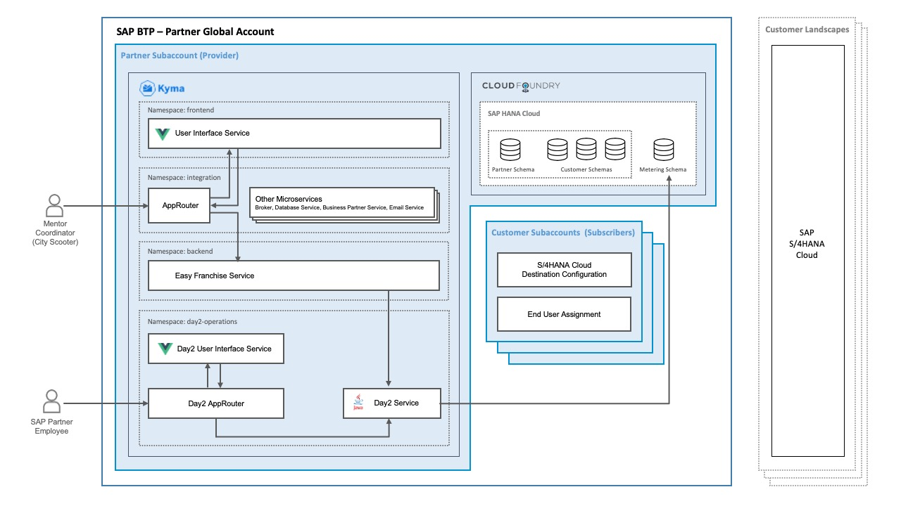

# Easy Franchise: Extend a Kyma-Based Multitenant Application with Day 2 Operations

> Important information: The content of this GitHub repository has been created as a source for the [Extend a Kyma-Based Multitenant Application with Day 2 Operations](https://discovery-center.cloud.sap/missiondetail/url-to-be-updated) mission at SAP Discovery Center. So, we recommend you use directly the mission in the SAP Discovery Center for a better experience.

## Description
This mission explains how to extend a Kyma-based multitenant application with day 2 operations topics like continuous integration and delivery, observability and metering.

It is related to the [Develop a Multitenant Extension Application in SAP BTP, Kyma Runtime](https://discovery-center.cloud.sap/missiondetail/3683/3726/) mission.

As a result, in this mission everything will be based on the multitenant application called Easy Franchise, which is a multitenant application running on SAP BTP, Kyma environment and extending SAP S/4HANA Cloud. We highly recommend that you have a look at the above mentioned mission where you can find all the necessary details. Be aware that we will not spend so much time here explaining the application. We will rather focus on enriching it with new features.

For the sake of simplicity, our team has taken some compromise compared to a real application. So, this application doesn't aim to be used productively.

Here is an overview diagram of the Easy Franchise application:

Here is an the overview diagram of the target solution at the end of the mission:

The repository has been structured in 2 sections:
* [documentation](./documentation/README.md): Contains the content of the mission, explaining in details how to enrich the existing Easy Franchise application.
* [code](./code): Contains the code and the deployment files of the multitenant application Easy Franchise and the Metering Dashboard Application. In addition, the [setup](https://github.tools.sap/saas-extension-on-kyma/easyfranchise-day2/tree/main/code/setup) folder contains a script to deploy the Easy Franchise application and the Day2 application automatically.

## Who Is This Mission For?

The business scenario of this mission has been created with the SAP partner as focus persona. This is, of course, not exclusively relevant for SAP partners and can be useful for every person (developer, operator, architect) looking for details on how to enrich a multitenant application running on Kyma with day 2 operations topics like continuous integration and delivery, observability and metering.
As mentioned before, we highly recommend to start with the [Develop a Multitenant Extension Application in SAP BTP, Kyma Runtime](https://discovery-center.cloud.sap/missiondetail/3683/3726/) mission as we are expecting some prior knowledge (for example, Kyma, and SAP BTP) to run this mission. As we are concentrating on advanced topics, this mission is mainly suitable for experienced developers on SAP Business Technology Platform (SAP BTP). 

## Focus Topics of the Mission

The mission focuses on the following aspects:
- Observability (logging, monitoring and alerting)
- Metering
- Continuous integration and delivery deployment

## Requirements

You can find all requirements to execute the mission in this [Prerequisites](./documentation/discover/prerequisites/README.md) section.

## Known Issues

The mission is provided on the "as-is" basis. Currently, there are no known issues for the project.

## How to Get Support?

Check if you find an answer in the [Troubleshooting](./documentation/troubleshooting/README.md) section.

Create an issue to get support, report a bug at the [Issues](https://github.com/SAP-samples/btp-kyma-day2-operations/issues/new/choose) section or interact with us via the SAP Discovery Center, in the *Conversations* section of the Project Board of the mission..

## How to Provide Feedback?

Have you found the enablement material easy to understand? Are you missing something? What can we improve? [Share your feedback](https://github.com/SAP-samples/btp-kyma-multitenant-extension/issues/new/choose), so that we can improve the documentation and provide a better material for future stakeholders.

## What's New

Check the details of our last [releases](./documentation/discover/whats-new/README.md).

## License

Copyright (c) 2022 SAP SE or an SAP affiliate company. All rights reserved. This project is licensed under the Apache Software License, version 2.0 except as noted otherwise in the [LICENSE](LICENSES/Apache-2.0.txt) file.
