# Deploy (CI/CD)

In this chapter we will have look at the SAP Continuous Integration and Delivery application. We will use two jobs in order to deploy the Easy Franchise ui and the Day 2 ui.

## Prerequisites

In order to deploy the application you need to prepare some things upfront.

1. GitHub repository
   The code needs to be available in a GitHub repository where you have access to. The easiest way to achive that is to create a fork of the easyfranchise-day2 repository. You can follow this [description](https://docs.github.com/en/get-started/quickstart/fork-a-repo) to create the fork. Note: This will require that you have a user in GitHub.com.
2. Personal Access Token
   In order to enable the communication between your GitHub repository and your job you need to provide credentials to the job. You can do this by creating a personal access token for your user as [described here](https://docs.github.com/en/authentication/keeping-your-account-and-data-secure/creating-a-personal-access-token). The token needs to have at least the "repo" and the "admin:repo_hook" including their childs.
3. Docker Hub account
   The images that are beeing build will be uploaded directly to an image repository. The easiest option is to create a personal [docker hub account](https://hub.docker.com/) and use a private repository.
4. Service Account
   As we will also perform a deployment to a kyma cluster we need to create a Service Account which we can use to authenticate against our cluster. You can create a service account either via cli as described in [this tutorial](https://developers.sap.com/tutorials/kyma-create-service-account.html) or via the kyma dashboard as shown below:

   1. In the kyma dashboard navigate to the frontend namespace
   2. Goto Configuration
   3. Select Service User Accounts
   4. Click on "Create Service Account +"
   5. Enter a name, e.g. "cicd"
   6. Click on create
   
   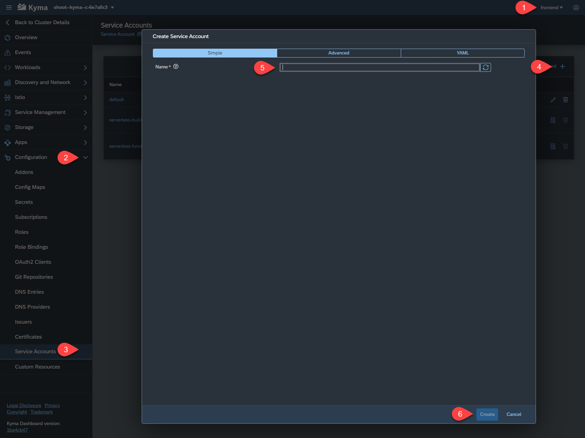

   1. Navigate to Role Bindings which is also under Configuration
   2. Click on "Create Role Binding +"
   3. Enter a name, e.g. cicd-binding
   4. Select "admin (CRI)" as role. (Note: Outside this tutorial you would like to restrict the permissions of a service account to the minimal scope and not grant admin privileges)
   5. Kind: ServiceAccount
   6. Service Account Namespace: frontend
   7. Service Account Name: cicd (or the name you choose during creation)
   8. Click on create

   

5. Download the Kubeconfig

   1. Navigate back to Service Accounts and select the created service account
   2. Download the kubeconfig to your local disk we will use it later
   
   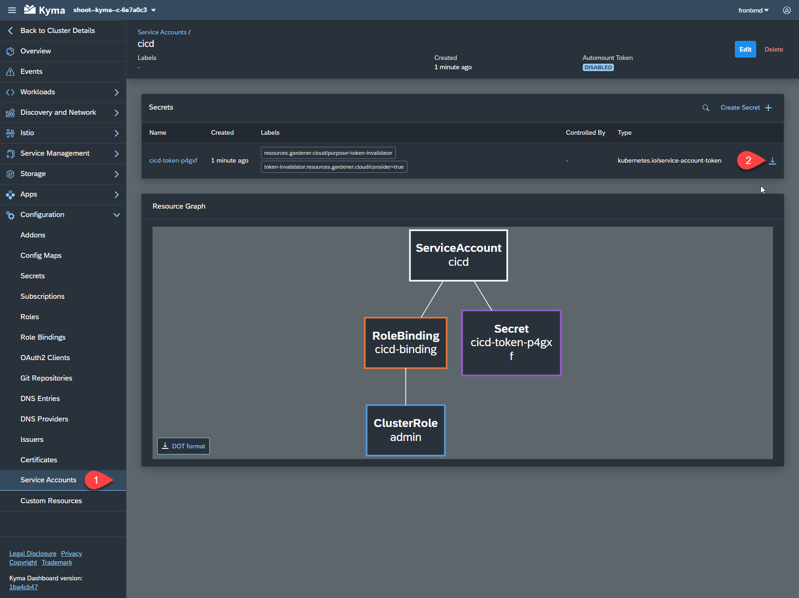

6. Repeat the steps above for the "day2-operations" namespace as well.

## Subscription of the CI/CD Application

**NOTE** If you used the SAP BTP Setup Automator script for this mission you can proceed to the job creation as the outlined steps are already done.

1. Add Entilement
   1. Navigate to Entitlements within the EasyFranchise subaccount
   2. Click on "Configure Entitlements"
   3. Click on "Add Service"

   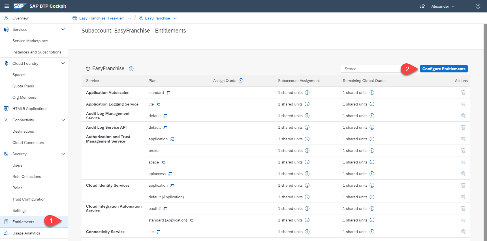

   1. Search for Continuous Integration & Delivery
   2. Select the "free (Application)" plan
   3. Click "Add 1 Service Plan"

   

2. Create the application subscription
   1. Navigate to the Service Marketplace
   2. Select the Continuous Integration and Delivery Entry
   3. Click on "Create"
   4. Leave the settings as suggested and click on "Create"
   
   

3. Role Assignement

   1. Click on Users
   2. Search for your user and click on it
   3. Choose Assign Role Collection

   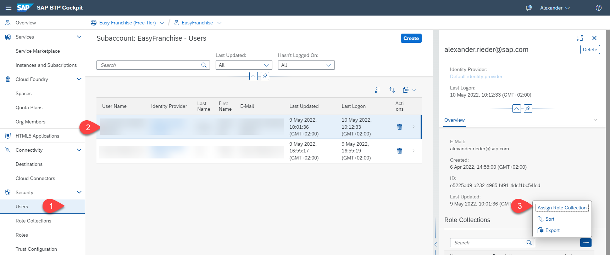

   1. Assign the CICD Service Administrator and the CICD Service Deloper role
   2. Click on "Assign Role Collction"

   

4. Launch the Application

   1. Navigate to Instances and Subscriptions
   2. Click on "Go to Application" in the menu of the Continuous Integration $ Delivery application

   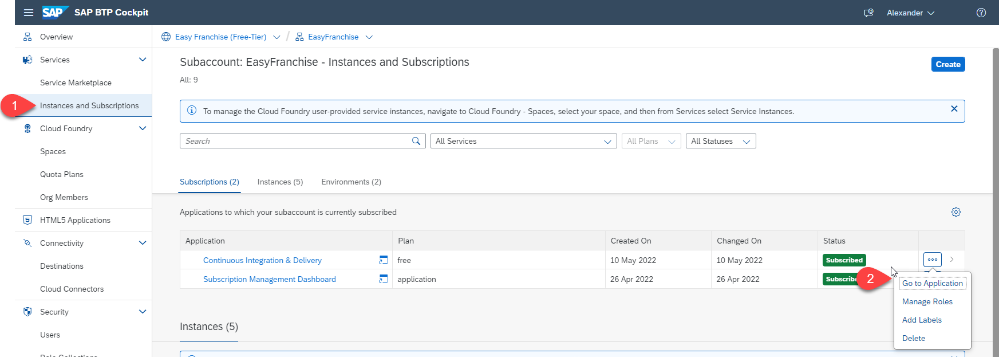

## Create Job for Easy Franchise UI

1. Step - General Information

   1. Click on the plus icon to create a new job
   2. Enter a Job Name and description, e.g. EasyFranchise-UI
   3. In the repository drop down select "Add Repository"

   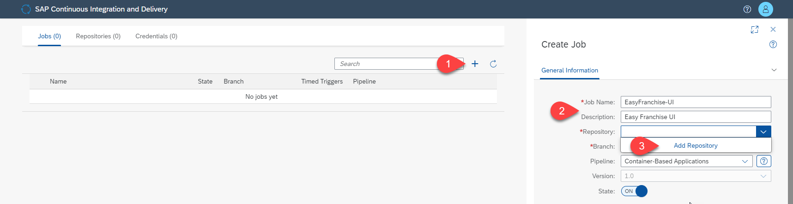

   1. Enter a name and the clone url of your git repository
   2. Click on "remove" to disable the webhook (we'll do that later)
   3. In the credentials dropdown, select "Create Credentials"

   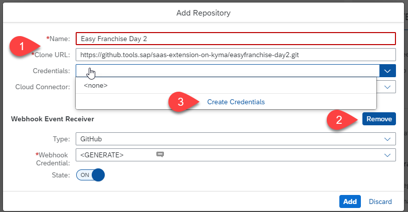

   1. Enter a name and description for your credentials, e.g. github.com
   2. Enter your github username and the personal access token that you have created in the prerequisites
   3. Click on "Create"
   4. You should be back in the "Add Repository" screen where you can click "Add"

   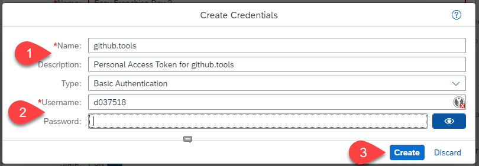

2. Step - General Parameters
   1. Enter the url to the container registry, (e.g. <https://docker.io> for Docker Hub)
   2. Enter the image name, for Docker Hub it follows this format "username"/"repository name"/"image-name". As free docker hub user you only have one private repository that you can use therefore we are using username and repository name as image name and make the component name part of the tag. That way we can push multiple images to the same repository.
   3. Usually the tag should be your version number of the image and ideally you choose the "Tag Container Image Automatically" to make sure you receive a new version every build. But as written above we will use the repository for more than one image and therefore select a dedicated image tag so we can better see what is happening in our registry.
   4. Click on "Create Credentials" on the Container Registry Credentials dropdown

   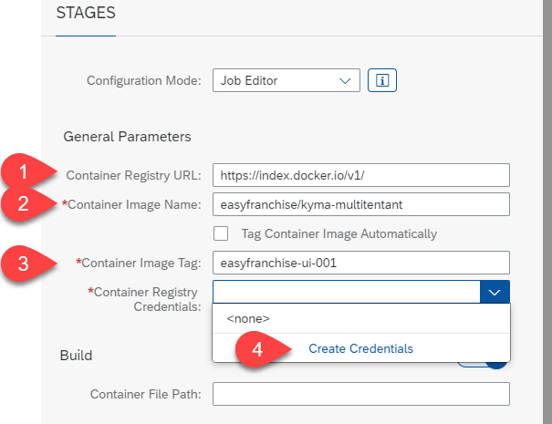

   1. Enter a name and description for the credentials, e.g. dockerhub
   2. Enter the credential information like that:

      ``` json
      {
      "auths": {
         "https://<Container Registry URL>": {
            "username": "<USERNAME>",
            "password": "<PASSWORD OR ACCESS TOKEN>"
         }
      }
      }
      ```

   3. Click on "Create"

   

3. Step - Build

   1. Enter the path to the dockerfile for the Easy Franchise ui: ```/code/easyfranchise/deployment/docker/Dockerfile-ui```
   

4. Step Release

   1. Disable the Acceptance step
   2. Enable the Release step
   3. Click on "Create Credentials" in the Kubernetes Credentials dropdown
   
   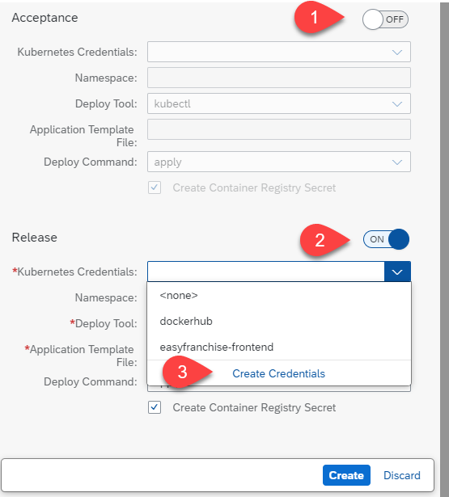

   1. Enter a name and description
   2. Paste the content of the kubeconfig.yaml which you have downloaded for the service account of the frontend namespace (see prerequisites)
   3. Click on "Create"

   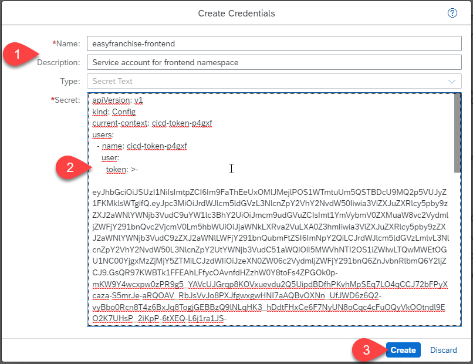

   1. Fill our the rest of the information:
      - Namespace: frontend
      - Deploy Tool: kubectl
      - Application Template File: ```code/easyfranchise/deployment/k8s/ui.yaml```
      - Deploy Command: apply
   2. Mark "Create Container Registry Secret" this will automatically create a secret in the cluster so that the image can be pulled from your repository
   3. Click on "Create" to finish the job definition

   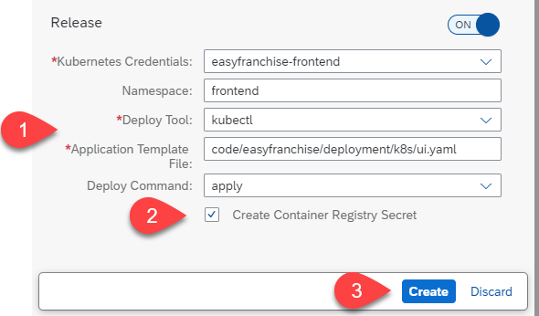

4. Execute the job
   1. Select the job
   2. Press the arrows to trigger a build
   3. You should see a new build job beeing initialized
   4. After the job has been finished it should look like in the picture

   

## Create Job for Day 2 UI

In general you can follow the same steps as for the EasyFranchise UI job. Furthermore you can reuse the created repository as well as the docker login. The only difference is during the release which we will outline below.
You can use the following values:

1. General Information
   - Job Name: Day2-UI
   - Description: Job for Day 2 UI
   - Repository: Choose the one created in the previous job
   - Branch: Enter the branch of your repository where the code is avaialbe (e.g. main)
   - Pipeline: Container-Based Applications

2. Stages - General Parameters
   - Container Registry URL: https://docker.io (if you use docker hub)
   - Container Image Name: "username"/"repository name"
   - Container Image Tag: day2-ui-001
   - Container Registry Credentials: Choose the one created in the previous job

3. Stages - Build
   - Container File Path: /code/day2-operations/deployment/docker/Dockerfile-day2-ui

4. Release
   - Kubernetes Credentials: Create new credentials using the kubeconfig for the service account that you have created for the day2-operations namespace (see prerequisites)
   - Namespace: day2-operations
   - Deploy Tool: helm3
   - Chart Path: /code/day2-operations/deployment/helmCharts/day2-ui-chart
   - Deployment Name: day2-ui

5. Finish and run
   1. Click on save to create the job
   2. Trigger a build
   3. If everything worked you should see that all stages are successfully executed
