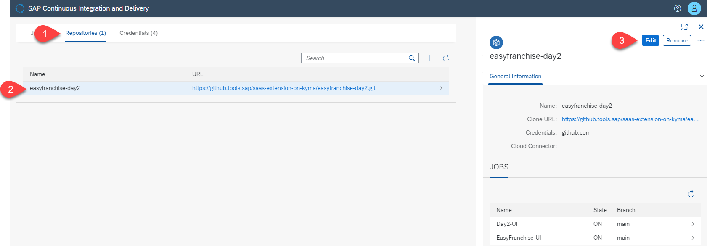
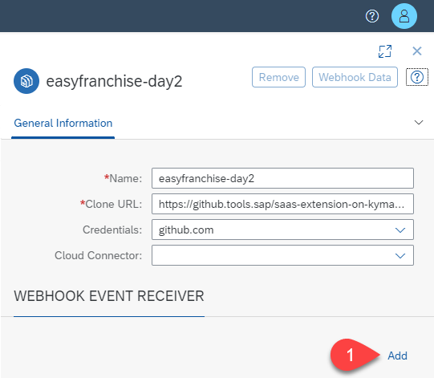
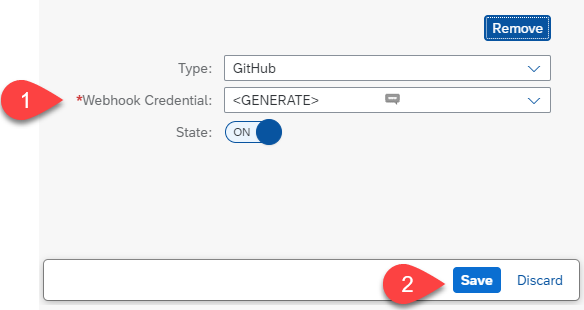
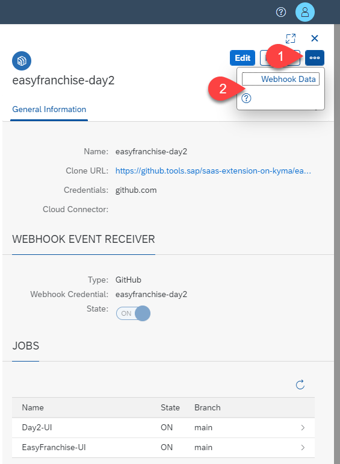
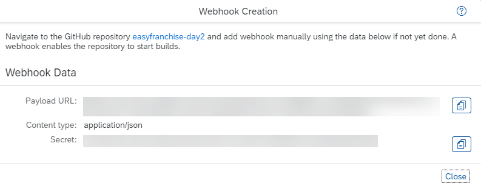
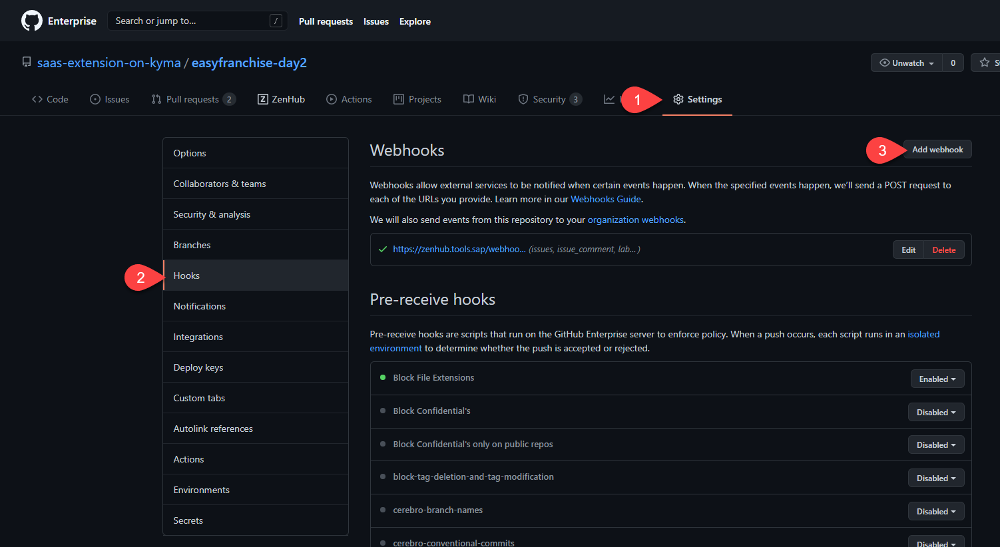
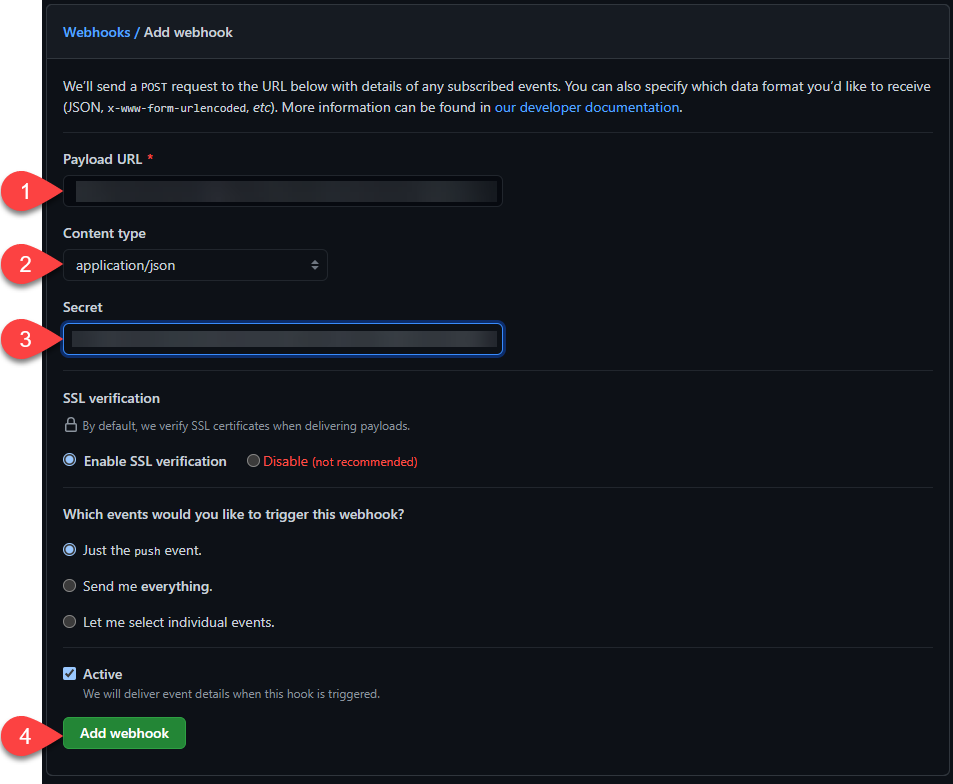
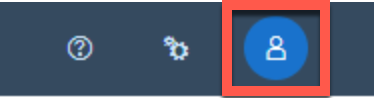

# Create a Webhook for the GitHub Repository

Now that we have created the jobs for both UI's, Easy Franchie UI and Day 2 Operations UI, we can trigger the build manually. What we actually want is that the build is triggered automatically each time when there is a change in the repository. Therefore, we will configure a webhook that reacts on changes.

## Enable the Webhook in Our Repository

1. In the overview screen of SAP Continuous Integration and Delivery, choose **Repositories**.
2. Select your repository.
3. Choose **Edit**.

   

1. In the repository edit screen, choose **Add**.

   

1. In the **Type** field, select **GitHub**.
2. In the **Webhook Credential** field, select **GENERATE**.
3. Choose **Save**.

   

## Get the Webhook Data

In the repository details, choose **...** and then choose **Webhook Data**.

   

* Either note down the payload URL and the secret or leave the window open, as we need these values for the webhook configuration.

   

## Configure the Webhook in GitHub

1. Open your repository in GitHub and choose **Settings**.
2. Choose **Hooks** and then choose **Add webhook**.

   

4. In the **Add webhook** dialog, fill in the following field:
   * **Payload URL**: use the Payload URL (see the chapter above).
   * **Contend Type**: application/json 
   * **Secret**: enter the secret (see chapter above)

5. Choose **Add webhook**.

   
  

## Do a Test Commit to Trigger the Build

In order to test the webhook, you can perform a change in the Easy Franchise application. Let's test it by changing something in the Easy Franchise UI.

1. Open the file [UserProfile.vue](../../../code/easyfranchise/source/ui/src/components/UserProfile.vue).

1. Change the header H1 from **User Profile** to **User Details**.
   ```
   <h1 class="mt-5 mb-5 text-center">User Details</h1>
   ```
1. Open the Easy Franchise application to see if the UI is correctly updated. On the top right corner in the bar, choose the user icon.
   

1. Verify that the page header is called now **User Details**.

1. Save the file and push the changes to the repository.

As soon as the changes are pushed, both jobs are triggered automatically. After the job is finished, open the application UI and check if your changes are there.

Note: As we have only changed one of the UIs, it would be unnecessary to trigger both jobs. But as we use one and the same repository and branch for each build job, we cannot prevent that.
