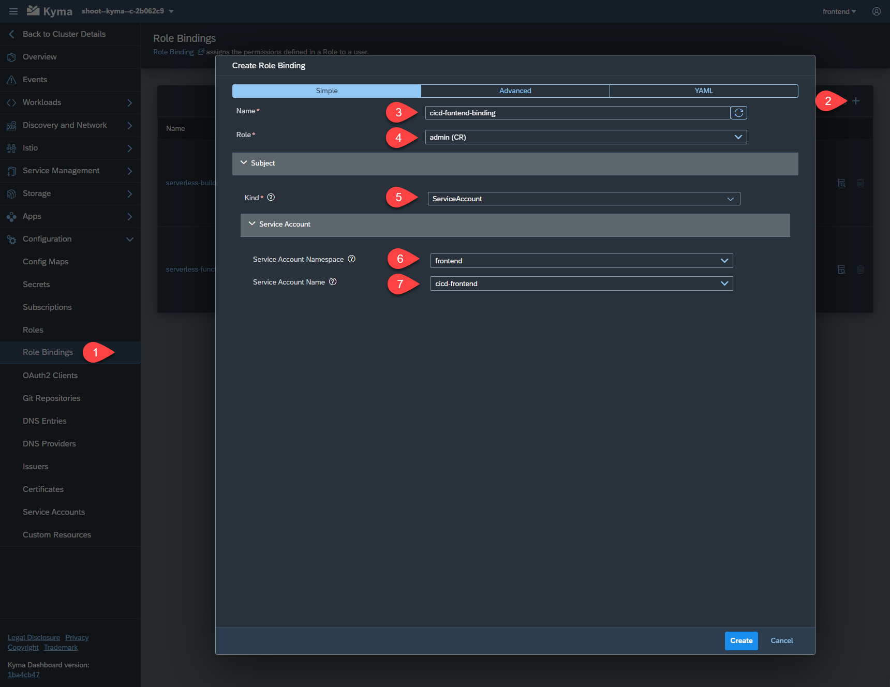
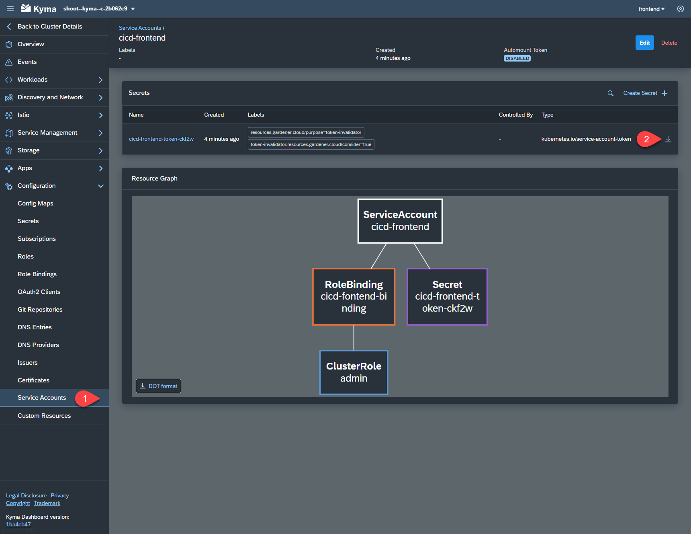

# Create Git repository and Kyma Service Account

In order to use the Continuous Integration and Delivery Service we need to prepare the needed environment as described below.

## Create Your Own GitHub Repository

You need your own GitHub repository, to be able to configure a webhook. The easiest way to achieve that is to create a fork of the [easyfranchise-day2 repository](https://github.com/SAP-samples/btp-kyma-day2-operations). You can follow this [description](https://docs.github.com/en/get-started/quickstart/fork-a-repo) to create the fork. To be able to fork, you need your own GitHub.com user.

In principle you can use any github repo, as long as it can be accessed from the internet, as the CI/CD Job needs to have access.

In order to enable the communication between your GitHub repository and your job you need to provide credentials to the job. You can do this by creating a personal access token for your user as [described here](https://docs.github.com/en/authentication/keeping-your-account-and-data-secure/creating-a-personal-access-token). The token needs to have at least the **repo** and the **admin:repo_hook** permissions including their children.

## Create a Personal Docker Hub Account

The Docker images that are being build will be uploaded directly to a Docker image repository. The easiest option is to create a personal [docker hub account](https://hub.docker.com/) and use a private repository.

## Create a CI/CD Service Account 

As we will also perform a deployment to a **Kyma** cluster we need to create a **Service Account** which we can use to authenticate against our cluster.

You can create a service account either via **cli** as described in [this tutorial](https://developers.sap.com/tutorials/kyma-create-service-account.html) or via the kyma dashboard as shown below:

1. In the **Kyma** dashboard navigate to the **frontend** namespace
2. Expand the **Configuration** menu on the left side
3. Select **Service Accounts**
4. Click on **Create Service Account** and **+** to get the **Create Service Account** dialog
5. In the **Create Service Account** dialog enter the name for the ServiceAccount, e.g. **cicd-frontend**
6. Click on **create**
  
   

##  Create a Cluster Role Binding

We need to create a **Role Binding**, so that you are able to access the Service Account you just created.

1. Take care that you still have selected the namespace **frontend**. Navigate to **Cluster Role Bindings** which is under **Configuration** menu.
2. Click on **+** to create a new Role Binding
3. In the **Create Role Binding** Dialog: 
   * Name: enter a name, e.g. **cicd-fontend-binding** 
   * Role: select **admin (CRI)** as role. (Note: In a productive environment you would like to restrict the permissions of a service account to the minimal scope and not grant admin privileges, but for a tutorial this is of no concern.) 
   * Kind: **ServiceAccount**  
   * Service Account Namespace: **frontend** 
   * Service Account Name: **cicd-frontend** (or the name you choose for your Service Account) 
   * Click on **create**
  
   

## Download the Kubeconfig of the Service Account

1. Navigate back to **Service Accounts** and select the created service account
2. Download the kubeconfig to your local disk we will need it later, when configuring the build job. 
   
   
