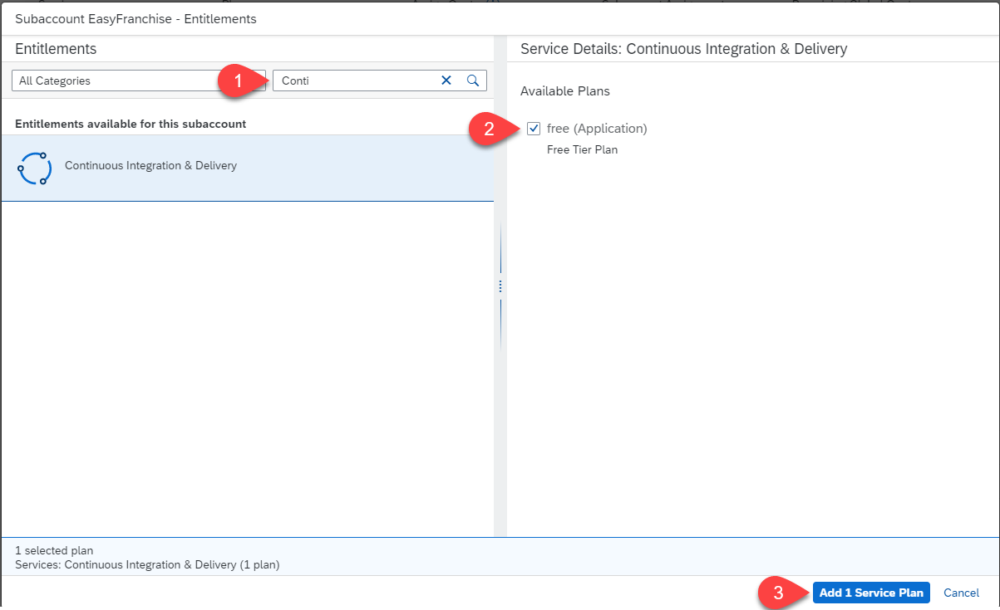
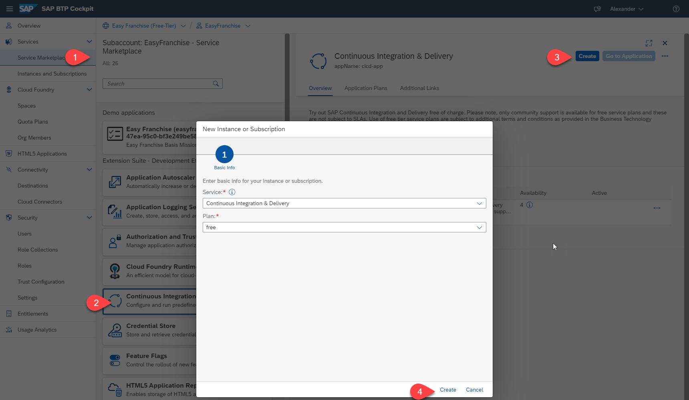

# Subscribe to "Continuous Integration and Delivery"

The following chapter can be skipped if you have used the BTP-Setup-Automator for preparing your subaccount as the necessary steps have already been performed. 

## Add Entitlement for Continuous Integration & Delivery

> **NOTE** If you used the SAP BTP Setup Automator script for this mission, the entitlements, subscription and role assignment is already done for you. Skip those steps and continue with 
> "Create CI/CD Job for Easy Franchise UI"

1. Navigate to **Entitlements** within the **EasyFranchise subaccount**
2. Click on **Configure Entitlements**
   
   
3. Click on **Add Service**
4. In the **Entitlements** Dialog 

   * Select search for **Continuous Integration & Delivery**
   * Select the **free (Application)** plan
   * Click **Add 1 Service Plan**

     

## Create the Application Subscription

1. In the EasyFranchise subaccount navigate to the **Service Marketplace**
2. Select the **Continuous Integration and Delivery** Entry
3. Click on **Create**
4. In the **New Instance Subscription Dialog** the plan **free** should be preselected. Click on **Create**

   

## Assignee CI/CD Roles to you

1. In the **EasyFranchise** subaccount click on **Users**
2. Search for your user and click on it
3. Choose **Assign Role Collection**

   
4. In the **Assign Role Collection** dialog assign the **CICD Service Administrator** and the **CICD Service Developer** role and click on **Assign Role Collection**

   