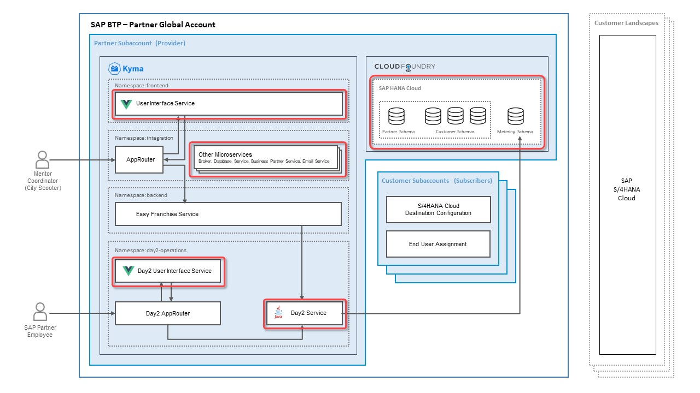
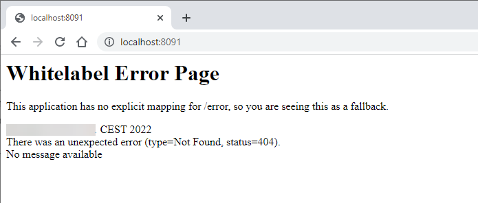
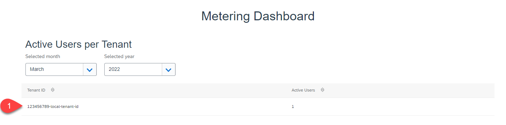

# Run the Metering Scenario End-to-End Locally
 
This chapter explains the steps to run all services involved in the metering scenario locally. This can be done on Windows, Mac or Linux.

You can use these services locally: 
* Database service
* Easy Franchise service
* Business Partner service
* Day2 service
* Easy Franchise UI
* Metering Dashboard UI



## Start the Database Service, the Easy Franchise Service, and the Business Partner Service

### Prerequisites
- You have prepared the SAP HANA Cloud properties for a JDBC connection. 
- You have a SAP S/4HANA Cloud system or a Business Partner mock server up and running 

### Configure the hiddenconfig.properties File

To run locally the services listed above, you have to configure some properties in the `hiddenconfig.properties` file:
1. Open the prepared sources from the previous steps or download the final one from the GitHub [Repository](../../../code/easyfranchise/source/backend). In the **day2-final** branch, you will find the source in the [code/easyfranchise/source/backend](../../../code/easyfranchise/source/backend) folder.

1. Copy the file ```code/backend/shared-code/src/main/resources/hiddenconfig-template.properties``` to `hiddenconfig.properties` in the same folder.

1. Maintain your SAP HANA Cloud JDBC connection properties in the `db.*` section. This should look like this:
   ```
   db.name: EasyFranchiseHANADB
   db.sqlendpoint: your_hostname.hanacloud.ondemand.com:443
   db.admin: EFADMIN
   db.password: your_efadmin_password
   ```

   For more details, see [How to find JDBC Connection Properties](https://github.com/SAP-samples/btp-kyma-multitenant-extension/tree/main/documentation/prepare/configure-hana#how-to-find-jdbc-connection-properties).

1. Update the `s4hana.destination.*` properties.

   If you use the SAP Business Partner mock server to run the application locally, use:

   ```
   s4hana.destination.URL: http://localhost:8081
   s4hana.destination.User:
   s4hana.destination.Password:
   s4hana.destination.Authentication: NoAuthentication
   s4hana.destination.Type: http
   ```

   If you use your SAP S/4HANA Cloud system, copy the following snippet. Be sure to update with your own values:
   ```
   s4hana.destination.URL: https://xxxxxxxx-api.s4hana.ondemand.com
   s4hana.destination.User: <your Communicatrion Arragement User>
   s4hana.destination.Password: <Password of the Communication User>
   s4hana.destination.Authentication: BasicAuthentication
   s4hana.destination.Type: http
   ```

### Build the Project
1. Open a command prompt and change the directory to ```code/backend``` containing the main '''pom.xml'''. Run the following Maven command:
   ```mvn clean install```

   > Info: When running this command the first time, many JAR files will be downloaded to your local Maven repository.

   The second run will be faster as all these downloads will no longer be necessary.

   You should see a successful build of all four modules and an allover **BUILD SUCCESS**:

   ```
      [INFO] Reactor Summary for easyfranchise 1.0-SNAPSHOT:
      [INFO]
      [INFO] easyfranchise ...................................... SUCCESS [  0.784 s]
      [INFO] shared-code ........................................ SUCCESS [ 18.696 s]
      [INFO] db-service ......................................... SUCCESS [  9.189 s]
      [INFO] bp-service ......................................... SUCCESS [  4.606 s]
      [INFO] ef-service ......................................... SUCCESS [  6.742 s]
      [INFO] ------------------------------------------------------------------------
      [INFO] BUILD SUCCESS
      [INFO] ------------------------------------------------------------------------
   ```

   In each project folder, a new folder **target** is created containing the build result.

### Start All Backend Services

1. Run the following commands to start the services. Start each in a separate command prompt and in the correct folder.

   In folder [code/backend/ef-service](../../../code/backend/ef-service):

   ||command (``> cd ef-service``)|
   |:-----|:----|
   |windows|```java -cp ".\target\*;.\target\dependency\*" -Dlocal_dev=true dev.kyma.samples.easyfranchise.EFServer 8080```|
   |unix   |```java -cp "./target/*:./target/dependency/*" -Dlocal_dev=true dev.kyma.samples.easyfranchise.EFServer 8080```|


   In folder [code/backend/bp-service](../../../code/backend/bp-service):

   ||command (``> cd bp-service``)|
   |:-----|:----|
   |windows|```java -cp ".\target\*;.\target\dependency\*" -Dlocal_dev=true dev.kyma.samples.easyfranchise.ServerApp 8100```|
   |unix   |```java -cp "./target/*:./target/dependency/*" -Dlocal_dev=true dev.kyma.samples.easyfranchise.ServerApp 8100```|

   In folder [code/backend/db-service](../../../code/backend/db-service):

   ||command (``> cd db-service``)|
   |:-----|:----|
   | windows | ```java -cp ".\target\*;.\target\dependency\*" -Dlocal_dev=true dev.kyma.samples.easyfranchise.ServerApp 8090```|
   | unix    | ```java -cp "./target/*:./target/dependency/*" -Dlocal_dev=true dev.kyma.samples.easyfranchise.ServerApp 8090```|


   Each service will run on a different port (8080, 8100, 8090). Don't use different ones. The `hiddenconfig.properties` relies on them!

   >*Hint:* Just in case you want to debug one of the applications using port `8888`, you can start the Java process using the following command. Then, connect with your IDE to the external Java process on port `8888`.

   >```
   >java -Xdebug -Xrunjdwp:transport=dt_socket,address=8888,server=y,suspend=y -cp "./target/*;./target/dependency/*" -Dlocal_dev=true dev.kyma.samples.easyfranchise.ServerApp <port>
   >```

### Test the APIs

1. Check that you can get all mentors:
   ``` 
   curl  --request GET 'http://localhost:8080/easyfranchise/rest/efservice/v1/mentor' 
   ```

   > Note: If the request fails, check the logs of ```ef-service``` and ```db-service```.

1. Check that you can read franchisees.
   ```
   curl --request GET 'http://localhost:8080/easyfranchise/rest/efservice/v1/franchisee' 
   ```
   > Note: If the request fails, check the logs of ```ef-service``` and ```db-service```.


## Run the Day2 Service

1. Open ```http://localhost:8091``` in a browser to check if the Day2 service is already started. You should get: 
   
   
1. If the server is not started please start it now.

## Run the Easy Franchise UI

1. Check that you have defined the URL path of the backend APIs to the local backend services. Open the file [code/easyfranchise/source/ui/src/main.js](../../../code/easyfranchise/source/ui/src/main.js) and check the value for ```Vue.prototype.$backendApi``` for:
   ```js
   Vue.prototype.$backendApi = "http://localhost:8080/easyfranchise/rest/efservice/v1";
   ```
1. Open a new terminal and change directory to **ui**.

   ```shell
   $ cd ui
   ```

1. Install Node.js modules in your repository by running:

   ```shell
   $ npm install
   ```

1. Run the server:

   ```shell
   $ npm run serve
   ```
   As result the application should show where it's running. 
   By default this is at: 

   ```
   http://localhost:8081/
   ```
1. Open this URL in a browser.
   
## Run the Metering Dashboard UI

1. Open a command prompt and go to [code/metering-dashboard/source/ui](../../../code/metering-dashboard/source/ui).

1. Install the Node.js modules.
   ```shell
   $ npm install
   ```
   
1. Start the service.
   ```shell
   $ npm run serve
   ```
   
   As result the application should show where it's running. 
   By default this is at: 

   ```
   http://localhost:8082
   ```
1. Open this URL in a browser.

1. As you already logged in to the Easy Franchise service, which is using the tenant ID 123456789-local-tenant-id, you should find an according record. 

   

1. If you would like to see a second tenant or increase the number of active users, you can achieve this by : 
   - Updating the properties ```devmode.tenantid``` in the ```hiddenconfig.properties``` of the backend services.  Stop, build and start the application again, so that the new tenant ID gets activated and reopen the Easy Franchise UI.
   - (Optional) Running a REST call against the Day2 service via CURL command and fake a user login of, for example, "Jon Smith" for "second-local-tenant-id": 
   
     ```shell
     curl --request PUT 'http://localhost:3000/user/login' \
     --header 'Content-Type: application/json' \
     --data-raw '{"tenantid": "second-local-tenant-id", "user": "Jon Smith"}
     ```
     
> Note: check our [troubleshooting page](./../../troubleshooting/no-active-user-metering-values/README.md) if you can't see any active user metering values.

## Result

* You understand now how to run a local test of all microservices and know the limitations of running the application locally. 
