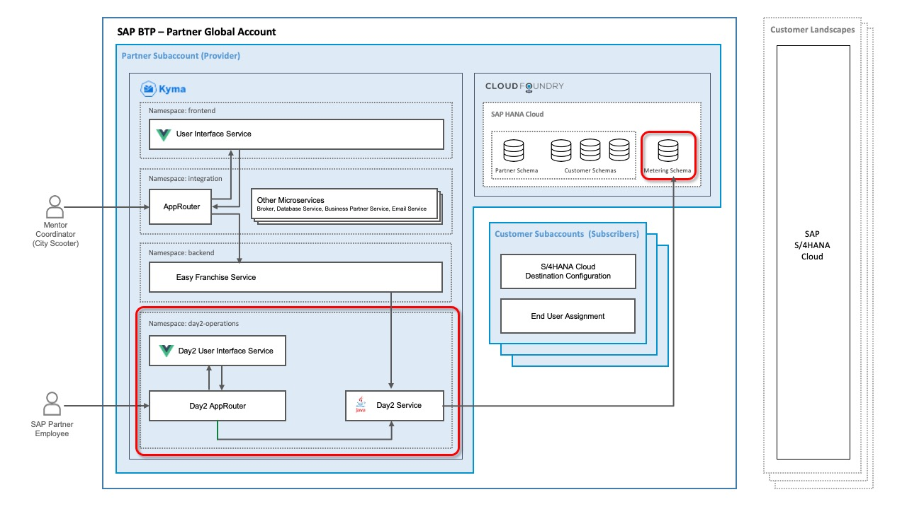
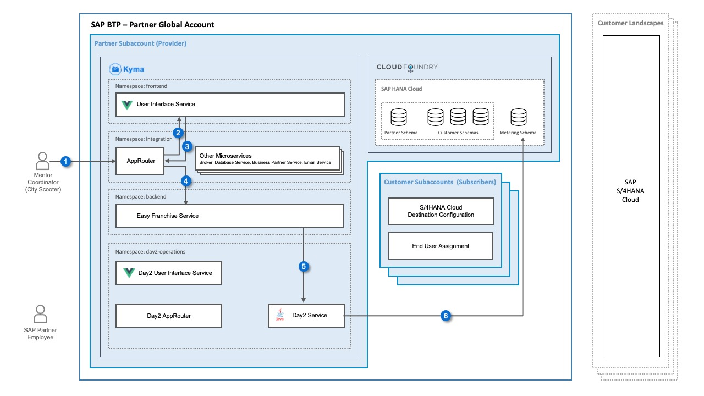
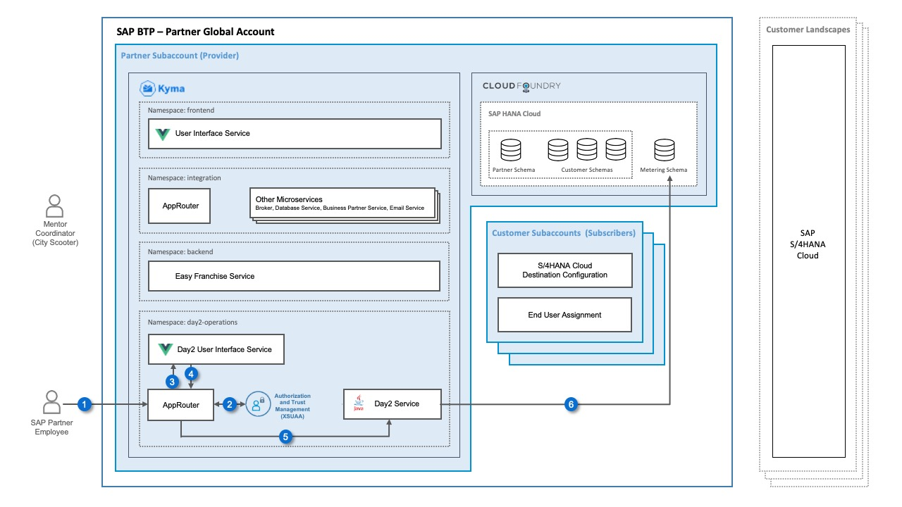
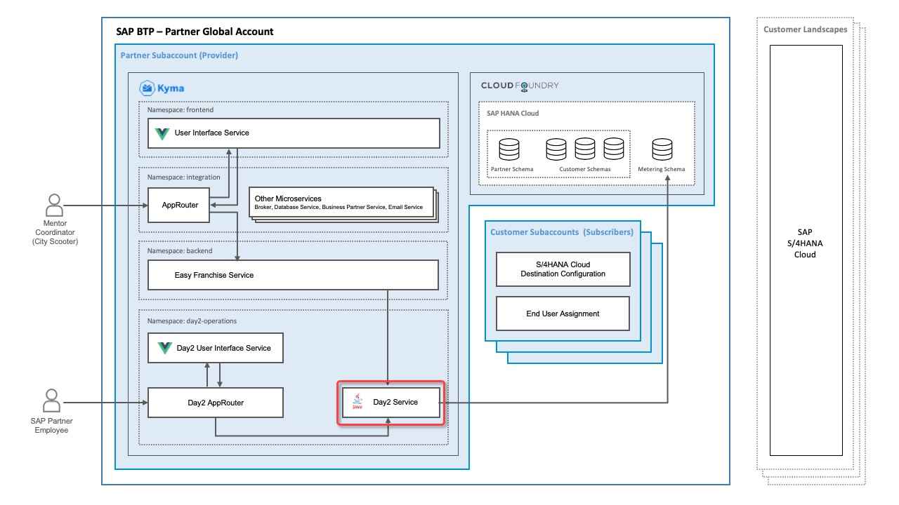
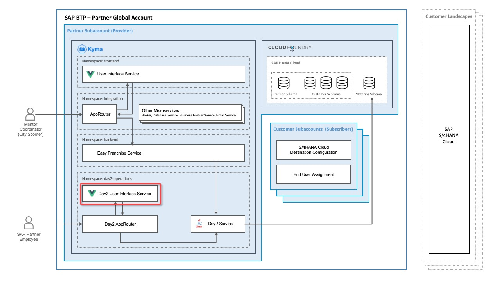
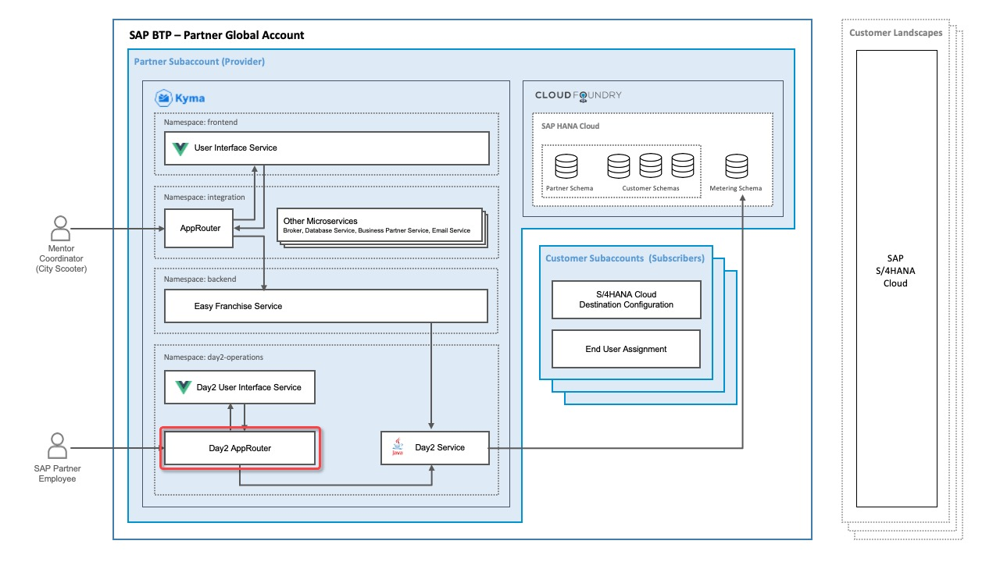

# Understand the Implementation of the Day2 Application

Lets first recap the architecture of the EasyFranchise application without metering:


To be able to meter **active users** we need new components. Have a look at the enhanced diagram:



The new namespace **day2-operations** consists of 3 components:
- Day2 UI: displays information about active users
- Day2 Approuter: routes the different requests
- Day2 Service: stores user login data and provides metering data to the Day2 UI. 

To be able to persist the user statistics we need:

- **metering database schema** in the existing **SAP HANA Cloud**. Note, that for simplicity we reuse the DBADMIN database user and his default schema to store the metering data as well. In a productive environment it would be recommended to create and use a metering database user and separate the easy franchise application data from the metering data by different database users.

## Understand the Data flow - User Login

Every time a mentor coordinator uses the Easy Franchise application, his user name will be passed to the Day2 service and saved in the metering schema.

 

Here are the details of the flow:
1. The mentor coordinator opens the Easy Franchise application.
1. The Approuter redirects the user to the UI.
1. Once the UI is initialized, the UI calls the new user/login API of the Easy Franchise service via the Approuter.
1. The Approuter routes the request to the Easy Franchise service.
1. The Easy Franchise service calls the Day2 service and provides tenant and user information from the PUT request header.
1. The Day2 service persists the login info in a tenant-independent database table. Current month and year are stored as well.

## Understand the Data flow - Displaying the Active Users 

Once the SAP partner employee opens the Day2 application to see the number of active users, the Day2 service will be requested to load the data saved in the metering table.

 

Here are the details of the flow:
1. The SAP partner employee opens the Day2 application in a browser. The browser sends a request to the Approuter.
1. The end user is redirected to the SAP Authorization and Trust Management service to log in.
1. The Approuter redirects to Day2 UI. 
1. The UI sends a request to Day2 service via the Day2 Approuter.
1. The Day2 service receives the request.
1. The Day2 service reads the active users data from the database.

## Details of the Metering Tables
Due to privacy, we aren't persisting each login with its timestamp in the database. As only the number of active users per month and tenant is needed, it is sufficient to save the user name, tenantId and the period (month+year).

The new database table is called  **USERLOGININFO** and has the following attibutes:
  * ID (unique Key)
  * TENANTID
  * USER
  * MONTH
  * YEAR


## New API of EasyFranchise Service

Whenever a user logs in, the **Easy Franchise UI** will call a new REST API to indicate a user login: 

```
curl --request PUT 'http://localhost:8080/easyfranchise/rest/efservice/v1/meter-user-login'
```

## Day2 Service APIs

The **Easy Franchise service** will call: 
```
curl --request PUT 'http://localhost:3000/user/login' \
  --header 'Content-Type: application/json' \
  --data-raw '{
     "tenantid": "tenant1",
     "user": "Jon Smith"    
}'
 ```

The **Day2 UI** will call:
```
curl --request GET 'http://localhost:3000/user/metric' \
 --header 'Content-Type: application/json' \
 --data-raw '{
     "year": "2022",
     "month": "3"
}'
```

An example JSON response of the above rest call is:
  
    ```
    [
        {"tenantid": "tenant1", "activeUsers": 1001 },
        {"tenantid": "tenant2", "activeUsers": 42 }
    ]
    ```


## Understand the Implementation of the Day2 Service



We have used Java as implementation language with [Spring Boot](https://spring.io/projects/spring-boot) and [Hibernate ORM](https://hibernate.org/orm/) as persistence framework. To start the project from scratch, we have used the [spring initializer](https://start.spring.io/) to speed up sources generation. 

The Java sources can be found at [code/day2-operations/source/day2-service/](../../../code/day2-operations/source/day2-service/).


The [UserRestControler](../../../code/day2-operations/source/day2-service/src/main/java/dev/kyma/samples/easyfranchise/day2/rest/service/UserRestControler.java) class implements the REST Endpoints **/user/metric** and **/user/login**.

[UserLoginInfo](../../../code/day2-operations/source/day2-service/src/main/java/dev/kyma/samples/easyfranchise/day2/jpa/entities/UserLoginInfo.java) defines the persistence Entity. We let Hibernate create the table for us.

[UserLoginInfoService](../../../code/day2-operations/source/day2-service/src/main/java/dev/kyma/samples/easyfranchise/day2/services/UserLoginInfoService.java) implements database access using an autowired [UserLoginInfoRepository](../../../code/day2-operations/source/day2-service/src/main/java/dev/kyma/samples/easyfranchise/day2/jpa/repositories/UserLoginInfoRepository.java). 

The following query provides the number of active users per tenant:

```
@Query("SELECT new dev.kyma.samples.easyfranchise.day2.rest.entities.UserMetric(tenantid, COUNT(user)) " + 
      "FROM  UserLoginInfo WHERE MONTH=?1 AND YEAR=?2 " + 
      "GROUP BY tenantid")
public List<UserMetric> getUserMetric(int month, int year);
```

To specify the properties, for example for the database, overwrite **application.properties** in the Java resource file [src/main/resources/application.properties](../../../code/day2-operations/source/day2-service/src/main/resources/application.properties). Here you can see which values are needed or recommended for local runs: [application-template.properties](../../../code/day2-operations/source/day2-service/application-template.properties) 

You can find more about configuring the properties at: [docs.spring.io: Properties & configuration](https://docs.spring.io/spring-boot/docs/1.0.1.RELEASE/reference/html/howto-properties-and-configuration.html)

## Understand and Run the Day2 UI

The user interface is developed with [SAP Fundamental Vue Library](https://sap.github.io/fundamental-styles/?path=/docs/introduction-overview--page). [SAP Fundamental Styles](https://sap.github.io/fundamental-styles/?path=/docs/introduction-overview--page) is a lightweight presentation layer, that can be used with various UI frameworks. With Fundamental Library Styles consistent SAP Fiori applications in any web-based technology can be built. In this tutorial, Vue is used as a framework to develop graphical user interfaces.



We decided to keep the UI very simple as this is not the focus in this mission. So the Day2 UI is based only on a single page where the dashboard is displayed. You can find the details in the file [MeteringDashboard.vue](../../../code/day2-operations/source/day2-ui/src/components/MeteringDashboard.vue).


## Understand the Implementation of the Day2 Approuter




The **Day2 Approuter** represents a single entry point to all Day2 microservices.
We use the [@sap/approuter](https://www.npmjs.com/package/@sap/approuter), which is a Node.js based implementation. 

The sources can be found at: [code/day2-operations/source/day2-approuter](../../../code/day2-operations/source/day2-approuter) 

The [package.json](../../../code/day2-operations/source/day2-approuter/package.json) specifies the start script. 

The [xs-app.json](../../../code/day2-operations/source/day2-approuter/xs-app.json) file defines the routes. For example, all sources fitting to pattern ```^/day2-service/(.*)$``` are routed to the destinstion ```day2-service```.

This destination is defined in the deployment section in the file [code/day2-operations/deployment/helmCharts/day2-approuter-chart/templates/approuter.yaml
](../../../code/day2-operations/deployment/helmCharts/day2-approuter-chart/templates/approuter.yaml):
```yaml
---
apiVersion: v1
kind: ConfigMap
metadata:
  name: destinations-config
  namespace: day2-operations
data:
  destinations: |
    [      
      {"name":"day2-service","url":"http://day2-service.day2-operations.svc.cluster.local:8091","forwardAuthToken" : true}
    ] 
```    

The SAP Authorization and Trust Managements service is defined in the [code/day2-operations/deployment/helmCharts/day2-approuter-chart/templates/approuter.yaml
](../../../code/day2-operations/deployment/helmCharts/day2-approuter-chart/templates/approuter.yaml):
```
apiVersion: servicecatalog.k8s.io/v1beta1
kind: ServiceInstance
metadata:
  name: xsuaa-service
  namespace: day2-operations
spec:
  clusterServiceClassExternalName: xsuaa
  clusterServicePlanExternalName: broker # https://jam4.sapjam.com/blogs/show/2dxT4cVGxTXZRJT0D1DQQM
  parameters:
    xsappname: day2-operations
    tenant-mode: dedicated
```

The **tenant-mode** is set to **dedicated** as Day2 application is not multitenant.


## Result
* You understand the implementation of the Day2 application components.
* You undersand the impmentation of the Day2 application components and have tested and validated the new APIs locally.
* You have learned how the Day2 Ui and the Day2 Approuter works.
