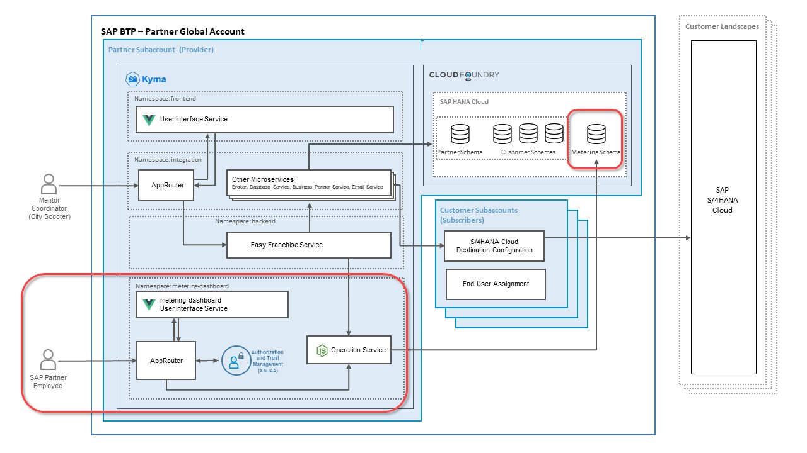
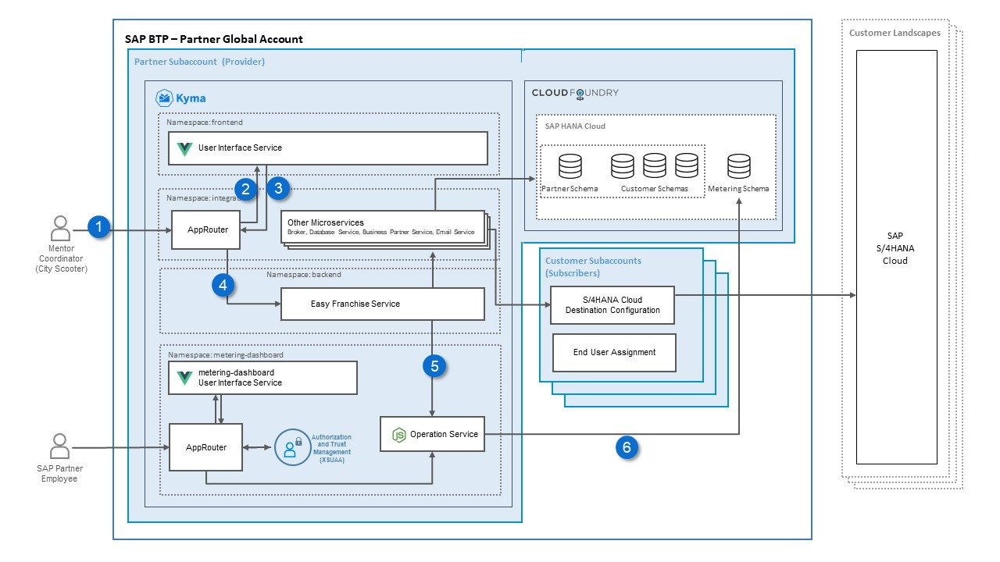
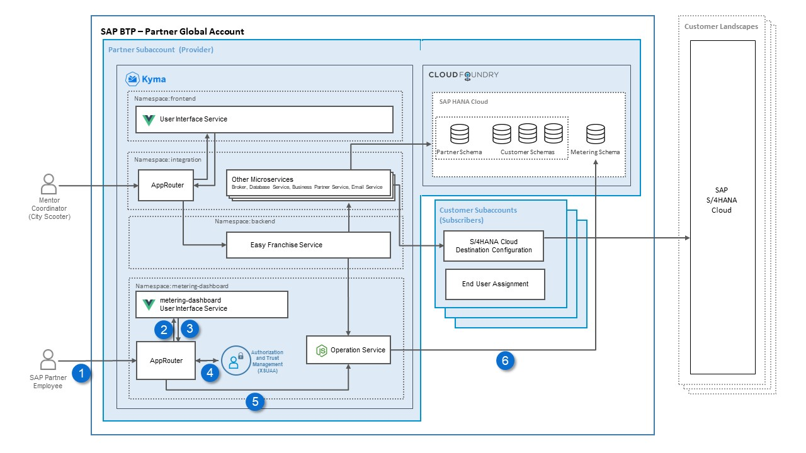
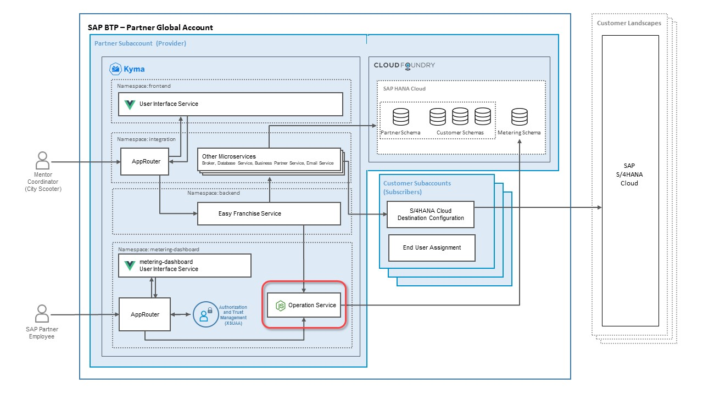

# Understand the Implementations of the Day2 Applications 

Lets first recap the architecture of the EasyFranchise application without metering:


To be able to meter **Active users** we need new components. Have a look at the enhanced Solution Diagram:



The new namespace **day2-operations**::
- Day2 UI: displays information about active users
- Day2 AppRouter: routes the different requests
- Day2 Service: stores user login data and provides the metering data to the Day2 UI. 

To be able to persist the user statistics we need:
- **metering database schema** in the existing **SAP HANA Cloud**. 

## Understand the Data flow - User Login

Every time a mentor coordinator uses the Easy Franchise application, his login will be handled by the Day2 service and saved in the metering schema.

 
<!-- TODO: update diagram -->

Here are the details of the flow:
1. The mentor coordinator opens the Easy Franchise app.
1. The AppRouter redirects the user to the UI.
1. Once the UI is initialized, the UI calls the new user/login API of the Easy Franchise Service via the AppRouter.
1. The AppRouter routes the request to the Easy Franchise Service.
1. The Easy Franchise Service calls the Day2 Service and provides the tenant and user information from the PUT request header.
1. The Day2 Service persists the login info in a tenant independent database schema named **Metering**. Current month and year are stored as well.

## Understand the Data flow - Display of Active Users 

Once the SAP partner employee opens the Day2 application to see the number of active users, the Day2 service will be requested to load the data saved in the metering schema.

 
<!-- TODO: update diagram  / Wrong order in numbers -->

Here are the details of the flow:
1. The SAP Partner employee opens the Day2 app in a browser. The browser sends a request to the Approuter.
1. The end user is redirected to the SAP Authorization and Trust Management service to log in.
1. The Approuter redirects to Day2 UI. 
1. The UI sends a request to Day2 service via the Day2 AppRouter.
1. The Day2 service gets the request and reads the active users from the database.

## Details of the Metering Schema
Due to privacy, we aren't persisting each login with its timestamp in the database. As only the number of active users per month and tenant is needed, it is sufficient to save the user name, tenantId and the period (month+year). 

The new database table is called  **USERLOGININFO** and has the following attibutes:
  * ID (unique Key)
  * TENANTID
  * USER
  * MONTH
  * YEAR


## New API of EasyFranchise Service

Whenever a user logs in the **Easy Franchise UI** will call a new Restapi to indicate a user login: 

```
curl --request PUT 'http://localhost:8080/easyfranchise/rest/efservice/v1/meter-user-login'
```

## Day2 Service APIs 

The **Easy Franchise Service** will call: 
```
curl --request PUT 'http://localhost:3000/user/login' \
  --header 'Content-Type: application/json' \
  --data-raw '{
     "tenantid": "tenant1",
     "user": "Jon Smith"    
}
 ```

The **Day2 UI** will call:
```
curl --request GET 'http://localhost:3000/user/metric' \
 --header 'Content-Type: application/json' \
 --data-raw '{
     "year": "2022",
     "month": "3"
}'
```

An example json response of the above rest call is:
  
    ```
    [
        {"TENANTID": "tenant1", "ACTIVEUSERS": 1001 },
        {"TENANTID": "tenant2", "ACTIVEUSERS": 42 }
    ]
    ```


## Understand the Implementation of the Day2 Service



TODO: check the namspease name! it should be **day2-operations**

We have used JAVA as implementation language with [Spring Boot](https://spring.io/projects/spring-boot) and [Hibernate ORM](https://hibernate.org/orm/) as persistence framework. To start the project from scratch, we have used the [spring initializer](https://start.spring.io/) to speed up sources generation. 

The JAVA sources can be found at [code/day2-operations/source/day2-service/](../../../code/day2-operations/source/day2-service/).


The [UserRestControler](../../../code/day2-operations/source/day2-service/src/main/java/dev/kyma/samples/easyfranchise/day2/rest/service/UserRestControler.java) implements the Rest Endpoints **/user/metric** and **/user/login**.

The [UserLoginInfo](../../../code/day2-operations/source/day2-service/src/main/java/dev/kyma/samples/easyfranchise/day2/jpa/entities/UserLoginInfo.java) defines the persistence Entity. We let Hibernate creates the tables for us.

The [UserLoginInfoService](../../../code/day2-operations/source/day2-service/src/main/java/dev/kyma/samples/easyfranchise/day2/services/UserLoginInfoService.java) implements the database access using an autowired [UserLoginInfoRepository](../../../code/day2-operations/source/day2-service/src/main/java/dev/kyma/samples/easyfranchise/day2/jpa/repositories/UserLoginInfoRepository.java). 

The following SQL statment provides the number of active users per tenant: 
   ```
   @Query("SELECT new dev.kyma.samples.easyfranchise.day2.rest.entities.UserMetric(tenantid, COUNT(user)) " + //
      "FROM  UserLoginInfo WHERE MONTH=?1 AND YEAR=?2 " + //
      "GROUP BY tenantid")
   public List<UserMetric> getUserMetric(int month, int year);
   ```

To specify properties eg. for the database, overwrite the **application.properties** from the java resource file [src/main/resources/application.properties](../../../code/day2-operations/source/day2-service/src/main/resources/application.properties) by one provided at runtime. A [application-template.properties](../../../code/day2-operations/source/day2-service/application-template.properties) shows you which values are needed or recommended for local runs. 

You can find more about configuring properties here: [docs.spring.io: Properties & configuration](https://docs.spring.io/spring-boot/docs/1.0.1.RELEASE/reference/html/howto-properties-and-configuration.html)

## Create Metering Database Admin User

To persist the data in the the database, it's recommended to have a new database user and not re-use an existing one so that you have a clear separation of data. You don't need to create a new database, creating a new user is sufficient. 

1. Get the inital Database Admin User credentials.
2. Open the **SAP HANA Database Explorer** and run the following SQL statement to create a new user called **EFMETERINGADMIN** within the group **EFOPERATORS**. Don't forget to replace the ```<YOURPASSWORD>```.

   ```sql
   -- Create the user and assign to the group EFOPERATORS
   CREATE USER EFMETERINGADMIN PASSWORD <YOURPASSWORD> SET USERGROUP EFOPERATORS;

   -- Make sure that the password should not expire
   ALTER USER EFMETERINGADMIN DISABLE PASSWORD LIFETIME;

   ```

## Add Database Details in the Application Properties

Once the database user created, we can configure the database source properties. 

1. Copy of [code/day2-operations/source/day2-service/application-template.properties](../../../code/day2-operations/source/day2-service/application-template.properties)  as **application.properties**
2. Update the values for those properties:
   * datasource.sqlendpoint: SAP HANA sql endpoint
   * spring.datasource.username: EFMETERINGADMIN 
   * spring.datasource.password: ```<YOURPASSWORD for EFMETERINGADMIN>```

## Build and Test Run the Day2 Service local

1. Open a command Window and change directory to [code/day2-operations/source/day2-service/](../../../code/day2-operations/source/day2-service/).
2. To run the application you have the choice between using spring-boot-plugin or an executive jar. 
3. Use the following command if you go for the spring-boot plugin:
   ```
   $ ./mvnw spring-boot:run -Dspring.config.location="application.properties"
   ```

   In case of remote debugging use: 
   ```
   $ ./mvnw spring-boot:run -Dspring-boot.run.jvmArguments="-agentlib:jdwp=transport=dt_socket,server=y,suspend=n,address=8888" -Dspring.config.location="application.properties"
   ```
4. Use the following command if you go for the executive jar: 
   ```
   $ ./mvnw clean package
   $ java -jar target/operations-service-0.0.1-SNAPSHOT.jar -Dspring.config.location="application.properties"
   ``` 
5. Check in the browser that the server is up and running by opening [http://localhost:8091/](http://localhost:8091/). You should get something like the following screenshot.
    
   

> Hint: in case you would like to use an **application.properties** file in another file location you can also specify the full path as follow:
  > ```
  > -Dspring.config.location="file:///Users/home/config/application.properties"
  > ```
  
## Call the APIs of the local running Day2 Service

1. Let us see if everything is working fine by simulating the user login with the following curl statement. As a result, this should insert a new record in the database table **USERLOGININFO**. 

   ```shell
   curl --request PUT 'http://localhost:8091/user/login' \
   --header 'Content-Type: application/json' \
   --data-raw '{
       "tenantid": "tenant1",
       "user": "Jon Smith"    
   }
   ```
   
1. Let us now verify that the login has been saved by calling the API to get the metrics about active users. Use the following CURL statement and don't forget to replace the date (```<CURRENT-YEAR>```and ```<CURRENT-MONTH-NUMBER>```) before running it.
   ```shell
   curl --request GET 'http://localhost:8091/user/metric?year=<CURRENT-YEAR>&month=<CURRENT-MONTH-NUMBER>' 
   ```

   You should then get a JSON response as follow:

   ```json
   [{ "TENANTID": "123456789-local-tenant-id", "ACTIVEUSERS": 1 }]
   ```

1. If you like, add other users and/or other tenants and verify the results.


## Understand and Run the Day2 UI

The user interface is developed with [SAP Fundamental Vue Library](https://sap.github.io/fundamental-styles/?path=/docs/introduction-overview--page). [SAP Fundamental Styles](https://sap.github.io/fundamental-styles/?path=/docs/introduction-overview--page) is a lightweight presentation layer, that can be used with various UI frameworks. With Fundamental Library Styles, consistent SAP Fiori apps in any web-based technology can be built. In this tutorial Vue is used as a framework to develop graphical user interfaces.

>TODO: Matthieu
> * add more details and explain coding
> * add "focus" Solution Diagram

## Understand the Implementation of the Day2 AppRouter

>TODO: Matthieu
> * add "focus" Solution Diagram

The **Day2 AppRouter** represents a single entry point to all Day2 microservices.
We use the [@sap/approuter](https://www.npmjs.com/package/@sap/approuter), which is a nodejs based implementation. 

The sources can be found here: [code/day2-operations/source/day2-approuter](../../../code/day2-operations/source/day2-approuter) 

The [package.json](../../../code/day2-operations/source/day2-approuter/package.json) specifies the start skript. 

The [xs-app.json](../../../code/day2-operations/source/day2-approuter/xs-app.json) file defines the routes. Eg all sources fitting to pattern ```^/day2-service/(.*)$``` are routed to the destinstion ```day2-service```.

This destination is defined in the deployment section in the file [code/day2-operations/deployment/helmCharts/day2-approuter-chart/templates/approuter.yaml
](../../../code/day2-operations/deployment/helmCharts/day2-approuter-chart/templates/approuter.yaml):
```yaml
---
apiVersion: v1
kind: ConfigMap
metadata:
  name: destinations-config
  namespace: day2-operations
data:
  destinations: |
    [      
      {"name":"day2-service","url":"http://day2-service.day2-operations.svc.cluster.local:8091","forwardAuthToken" : true}
    ] 
```    

The xsuaa services is defined in the [code/day2-operations/deployment/helmCharts/day2-approuter-chart/templates/approuter.yaml
](../../../code/day2-operations/deployment/helmCharts/day2-approuter-chart/templates/approuter.yaml):
```
apiVersion: servicecatalog.k8s.io/v1beta1
kind: ServiceInstance
metadata:
  name: xsuaa-service
  namespace: day2-operations
spec:
  clusterServiceClassExternalName: xsuaa
  clusterServicePlanExternalName: broker # https://jam4.sapjam.com/blogs/show/2dxT4cVGxTXZRJT0D1DQQM
  parameters:
    xsappname: day2-operations
    tenant-mode: dedicated
```

The **tenant-mode** is set to **dedicated** as day 2 app is not multitenant.


## Result
* You understand the implementation of the Day2 application components.
* You andersand the impmentation of the Day2 application components and have tested and validated the new APIs locally.
* You have learned how the Day2 Ui and the Day2 AppRouter works.
