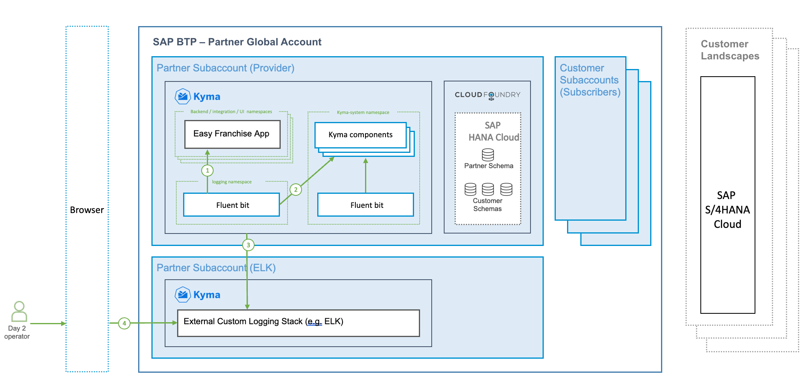
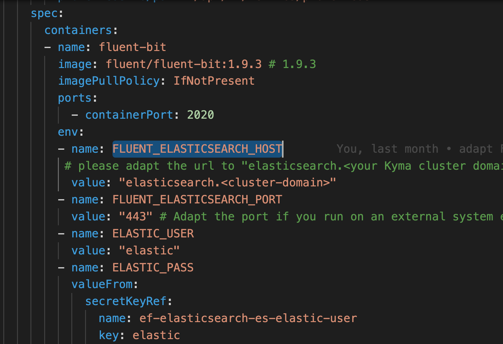
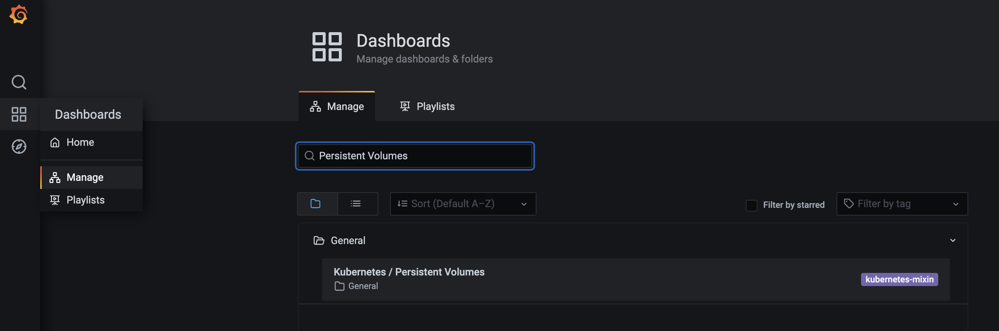
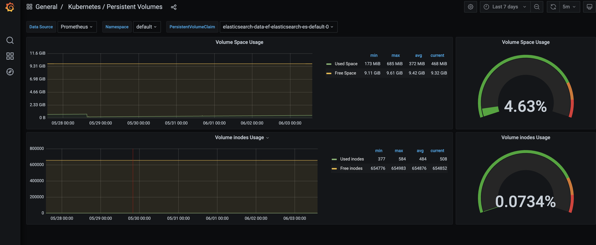

# Exporting application logs to external logging tools

## Introduction
By default a fluentbit instance has been configured in **kyma-system** namespace.  It then forwards the logs to a Loki instance inside **kyma-system**. To access the Loki instance you can check [Exposing built-in Grafana securely with Identity Authentication(IAS)](/documentation/observe/expose-grafana-with-ias/README.md).   However, the fluentbit instance in **kyma-system** cannot be extended to forward logs to external tooling.  This tutorial describes how to install a custom log collector in custom namespace, then export the logs to an external logging tools such as ELK stack (Elasticsearch and Kibana).

Below diagram shows the target setup of our scenario.  

1. A second fluentbit instance is installed in custom namespace. It extracts all logs avaiable in Kyma cluster, including logs from Easy Franchise App.

1. Additionally the logs from Kyma components are collected as well.  It is also possible to exclude the kyma-system namespace from log collection.

1. The fluentbit is configured to forward all logs to an ELK stack. 

1. An ELK stack is installed in a separate Kyma cluster, serving as an external log viewing tool.   If a separate cluster is not available, you could also use the same cluster as EasyFranchise app. The concept would be rather similar. 

1. A day2 operator would accesss the logging tool via browser. 




## Install ELK stack in Kyma cluster

In this step we use ELK stack as an example for external logging tooling.   You can certainly choose any other tools as long as the protocol is supported by log collector. 

The default configurations will install ELK stack in the same Kyma cluster where EasyFranchise app is deployed. This is to accommodate situation where only one Kyma cluster is available (e.g. in case of using BTP trial account).  If you do have second Kyma cluster, you can opt to install ELK stack in a seperate cluster. The setup is very similar.

We are using official [Elastic Cloud on Kubernetes](https://www.elastic.co/guide/en/cloud-on-k8s/current/index.html) provided by Elastic.  It is essentially a set of Kubernetes operators orchestrating lifecycle of Elastic search, Kibana and a few other Elastic resources.  In our example we only need to deploy Elasticsearch and Kibana CRD (customer resource definition).

> Note: In above diagram the ELK stack is depicted as "External Custom Logging Stack" in a second Kyma cluster to better illustrate the flexibility of the scenario. You can certainly deploy ELK in the same Kyma cluster where your EasyFranchise app is running.

```shell
# Install Elastic CRD and the operator with its RBAC Rules  https://www.elastic.co/guide/en/cloud-on-k8s/1.9/k8s-deploy-eck.html

kubectl apply -f https://download.elastic.co/downloads/eck/1.9.1/crds.yaml

kubectl apply -f https://download.elastic.co/downloads/eck/1.9.1/operator.yaml

```

Then deploy a new instance for Elasticsearch and Kibana respectively. 


```shell
# Make sure move to folder code/day2-operations/deployment/k8s/elk-stack

# Deploy Elasticsearch CRD and expose elasticsearch service via APIRule


kubectl apply -f elastic_on_cloud.yaml

kubectl apply -f elastic-expose.yaml


# Deploy Kibana CRD and expose kibana service via APIRule

kubectl apply -f kibana.yaml

kubectl apply -f kibana-expose.yaml


```

Once above resources are deployed, you can check the status of the deployment with following command:

```shell
$ kubectl get elastic

NAME                                                          HEALTH   NODES   VERSION   PHASE   AGE
elasticsearch.elasticsearch.k8s.elastic.co/ef-elasticsearch   green    3       7.15.0    Ready   41m

NAME                                     HEALTH   NODES   VERSION   AGE
kibana.kibana.k8s.elastic.co/ef-kibana   green    1       7.15.0    38m

```

In addition, you can also access Kibana and Elasticsearch in your browser. To find out the URL please run following commands:

```shell

$ kubectl get virtualservices.networking.istio.io

NAME                   GATEWAYS                                         HOSTS                                                 AGE
elastic-expose-qwrn4   ["kyma-gateway.kyma-system.svc.cluster.local"]   ["elasticsearch.<your Kyma cluster domain>.kyma.ondemand.com"]   47m
kibana-expose-s855g    ["kyma-gateway.kyma-system.svc.cluster.local"]   ["kibana.<your Kyma cluster domain>.kyma.ondemand.com"]          47m

```

For login you can use  "elastic" as username, and password can be extracted in your cluster with following command:

```shell

kubectl get secret ef-elasticsearch-es-elastic-user -o go-template='{{.data.elastic | base64decode}}'

```

The **login credentials**  will also be needed for configuring fluentbit instance in next step.

## Install log collector fluentbit

Next we will install log collector fluentbit in a custom namespace.  The fluentbit collects logs on all nodes in Kyma cluster and forwards to Elasticsearch which is deployed in previous chapter. Please open file [fluentbit.yaml](/code/day2-operations/deployment/k8s/fluentbit.yaml), and replace following parameter with your own value:

- Adapt the value for "FLUENT_ELASTICSEARCH_HOST" with your elasticsearch URL which retrieved from previous step, e.g."elasticsearch.<your Kyma cluster domain>.kyma.ondemand.com"



- Fluentbit requires username and password in order to forward logs to Elasticsearch.  We are using envrionment variables `ELASTIC_USER` (default to "elastic") and `ELASTIC_PASS` to pass the value.  If Elasticsearch is deployed in the same cluster as your workload, the password for Elasticsearch has been created automatically and saved in secret `ef-elasticsearch-es-elastic-user` , and you can skip this step.  However, if Elasticsearch is deployed in a different cluster (referred as **ELK cluster**), please extract Elasticsearch password from ELK cluster, then create a secret as following in the EasyFranchise app cluster:

```shell
# Make sure you are in ELK cluster, and extract the password of Elasticsearch

kubectl get secret ef-elasticsearch-es-elastic-user -o go-template='{{.data.elastic | base64decode}}'

# Now switch to EasyFranchise cluster, and create a secret using above extract value.
kubectl create secret generic ef-elasticsearch-es-elastic-user --from-literal=elastic=<output from previous command>

```

Then deploy the **fluentbit.yaml** in your Kyma cluster. 

> Note: Please deploy fluentbit in the Kyma cluster where your workload (e.g. EasyFranchise app) is running.

```shell

kubectl deploy -f fluentbit.yaml

```

## Verify Logs in Kibana

To verify if the logs have been properly pushed into Elastic search, you can try following URL in your browser: ```https://elasticsearch.<your Kyma cluster>.kyma.ondemand.com/_cat/indices```


You should see an incies with prefix "fluentbit". 


In your Kibana, go to "Index Management" (```https://kibana.<your Kyma cluster>.kyma.ondemand.com/app/management/data/index_management/indices```), you should also see the fluentbit indices.


Then go to "Index Pattern" (```https://kibana.<your Kyma cluster>.kyma.ondemand.com/app/management/kibana/indexPatterns```) to create a new index pattern.


Then go to "Analytics --> Discover" to see the logs


## Troubleshooting

- Check PVC usage of Elasticsearch

  * Option 1: command line

    ```shell

    kubectl -n <namespace> exec <pod-name> df

    # e.g.
    kubectl exec -it ef-elasticsearch-es-default-2 df

    ```
  
  * Option 2: Prometheus metrics dashboard
    
    Open the build-in Grafana dashboard, navigate to Dashboard --> Manage, then search and select dashboard **Persistent Volumes**.

    


    


- To clean up the Elasticsearch index, you can deploy curator as below

  ```shell
    kubectl apply -f curator.yaml
  ```

  You can check the cronjob schedule with following command

  ```shell
    kubectl get cronjob
  ```
