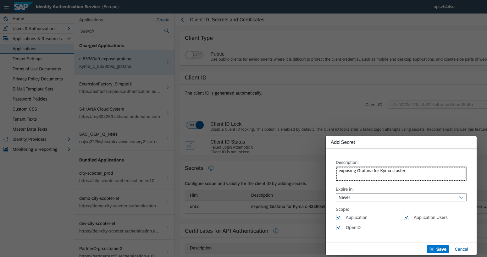
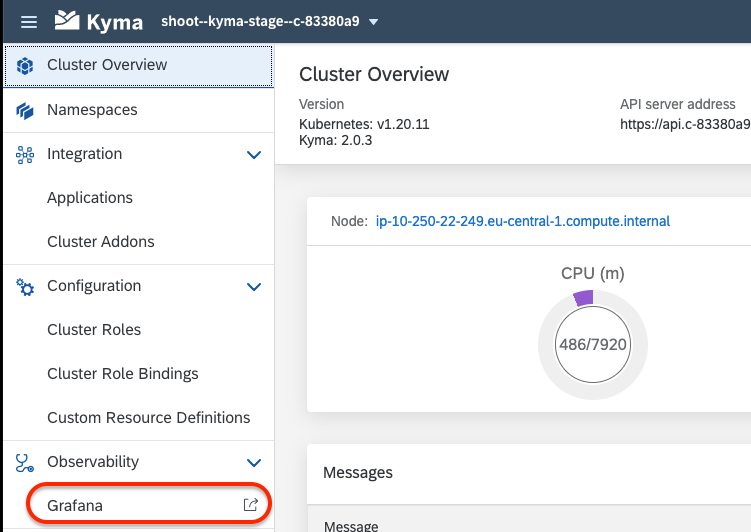

# Exposing Grafana securely with Identity Authentication(IAS)

>Brittas Review  Comments (TODO):
>* please provide here som background: What is Grafana, which problem will we solve in the  below steps. A Solution Diagram might be helpfull as well 
>* Don't use Appropriation (like IAS) befor you have provided the Long name. We have so many of them that the reader might not now what it is. 

## Configuration in IAS
 <!-- https://apsvh44su.accounts400.ondemand.com/admin/#/applications/61fa53da699b9778e8abec53/trust -->

 >Brittas Review  Comments (TODO):
 >*  proposal for new heading: "Configure the SAP Identity Authentication Service so that ..."
 >*  provide a paragraph with contend- why will I do the next steps. what will I gain?
 >*  What do I have to do so that I see the first picture?  How to get the IAS-dashboard.Please provide this step!
 >*  Can we remove the comment above "https://apsvh44su.accounts400.ondemand.com/admin/#/>applications/61fa53da699b9778e8abec53/trust"?

1. Set protocol to OpenID Connect, choose a name and set the callback URL to the _/oauth2/callback path_.

   
      
   

   Note that the Kyma cluster has the domain has the format "https://grafana.`<cluster-domain>`/",  e.g. https://grafana.c-83380a9.stage.kyma.ondemand.com/

2. Create a secret in IAS for API Authentication

   

3. Create a Secret for OAuth2 Proxy in Kyma cluster

   > Brittas Review  Comments (TODO):
   > * please provide the info where i can find the needed IAS properties

   ```shell
   # Replace value from below from your own IAS
   
   kubectl -n kyma-system create secret generic monitoring-auth-proxy-grafana-user \
   							--from-literal="OAUTH2_PROXY_CLIENT_ID=<client_id_from_IAS>" \
   							--from-literal="OAUTH2_PROXY_CLIENT_SECRET=<client_secret_from_I   AS>" \
   							--from-literal="OAUTH2_PROXY_OIDC_ISSUER_URL=<IAS URL>" \
   							--from-literal="OAUTH2_PROXY_PROVIDER=oidc" \
   							--from-literal="OAUTH2_PROXY_SCOPE=openid email" \
   							--from-literal="OAUTH2_PROXY_SKIP_PROVIDER_BUTTON=true"
   ```

4. Restart the OAuth2 Proxy pod by run the following command

   ```shell
   
   kubectl -n kyma-system rollout restart deployment monitoring-auth-proxy-grafana
   
   ```
## Learn Which Data can be found in Grafana 
> Brittas Review  Comments (TODO):
> * the above header is only a proposal, is this what you would like to do in this chapter? reface if needed
> 

1. Now click on the Grafana link 
  
   > Brittas Review  Comments (TODO):
   > * Where do i find this "Grafana link"? provid this info. I assume i have to open my Kyma account? 
   > * our convection of highlighting is to use those drop-like-numbers from snaggit. When updating the Picture, please use this highlight, so that our mission gets a similar look and feel
   >* please describe what is the benefit of having this Grafana link? What can i do with it? Which info do i find where? Please describe and give some guidance! add more detailed Steps

   
   
## Result 
TODO: write this chapter


## Reference:

https://github.tools.sap/kyma/backlog/issues/2281#issuecomment-689318

https://help.sap.com/viewer/DRAFT/60f1b283f0fd4d0aa7b3f8cea4d73d1d/Internal/en-US/3e4299cfd0884c428e6b4774225638e8.html
