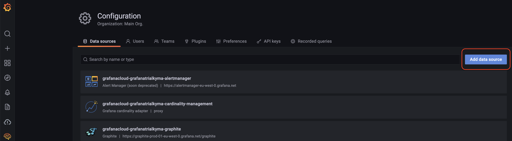
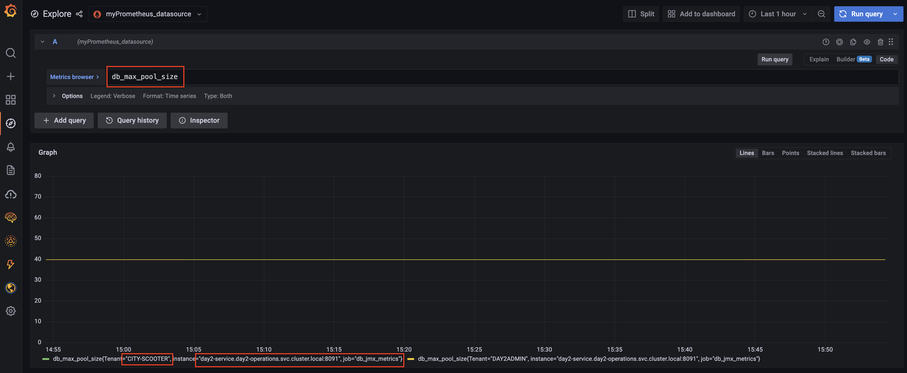

# Monitoring Kyma and Custom Workload Metrics with Custom Prometheus

By default a Prometheus instance has been deployed in **kyma-system** namespace by Prometheus Operator when Kyma is initially provisioned. The built-in Prometheus instance is responsible to scrape metrics of Kyma components in that namespace.  However, due to Kubernetes reconciliation, any changes in **kyma-system** namespace will be reverted to its original state, hence with the built-in Prometheus it is not possible to scrape additional metrics of any custom workload.  

In this chapter we will show how to deploy a custom Prometheus instance to scrape custom metrics, while at the same time collects metrics from the build-in Prometheus via /federation endpoint. It will consolidate metrics from different source into one single Prometheus instance. In addition, we will redirect the metrics from custom Prometheus instance to an external tooling, such as [Grafana Cloud Service](https://grafana.com/auth/sign-up/create-user) or a custom Grafana instance in your Kyma cluster.

<!-- TODO Matthieu: why not add Solution Diagram showing all the data flows described above? -->

## Install Custom Prometheus

Among other options, Prometheus could be easily installed using (1) [Prometheus operator kube-prometheus-stack](https://github.com/prometheus-community/helm-charts/tree/main/charts/kube-prometheus-stack) or typical (2) [Kubernetes deployment or statefulset](https://github.com/prometheus-community/helm-charts/tree/main/charts/prometheus).   However, the Prometheus operator in Kyma cluster, which is installed during cluster provision, will ony watch **kyma-system** namespace for any Prometheus CustomResourceDefinition and ignore any other namespace. This is configured through [Prometheus operator command line flag --namespaces](https://github.com/prometheus-operator/prometheus-operator/blob/main/Documentation/operator.md#operator-cli-flags) as shown below. As a result, we decide to deploy our custom Prometheus using the Kubernetes deployment.

```
kubectl get deployment -n kyma-system monitoring-operator -o yaml
```

You will get the below yaml as response:

<pre><code>
apiVersion: apps/v1
kind: Deployment
metadata:
  name: monitoring-operator
  namespace: kyma-system
spec:
  template:
    metadata:
      annotations:
        sidecar.istio.io/inject: "false"
    spec:
      containers:
      - args:
        - --kubelet-service=kube-system/monitoring-kubelet
        <b>- --namespaces=kyma-system      # Prometheus operator will only watch Prometheus resources in kyma-system namespace  </b>
        - --localhost=127.0.0.1
        ...
</code></pre>


Follow below steps to install custom Prometheus in your Kyma cluster. In our case it will be installed in **default** namespace.

```shell
# add Prmetheus helm chart repo to your local helm repo
helm repo add prometheus-community https://prometheus-community.github.io/helm-charts
helm repo update

# list avaiable charts version
helm search repo -l prometheus-community/prometheus

# fetch the Prometheus helm charts of desired version and save it locally under subfolder "prometheus"
helm fetch  prometheus-community/prometheus --untar  --version 15.8.5
```

Then we will disable unnecessary components in the charts, and add two jobs to scrape additional metrics. Make a copy of the file **prometheus/values.yaml** and save as **prometheus/prometheus_custom_values.yaml**, and adapt the value according to below example. 

```diff
## Define serviceAccount names for components. Defaults to component's fully qualified name.
##
serviceAccounts:
  alertmanager:
-    create: true     # --> do not create serviceaccount for alertmanager
+    create: false
    name:
    annotations: {}
  nodeExporter:
-    create: true     # --> do not create serviceaccount for nodeExporter
+    create: false
    name:
    annotations: {}
  pushgateway:
-    create: true     # --> do not create serviceaccount for pushgateway
+    create: false
    name:
    annotations: {}
  server:
    create: true
    name:
    annotations: {}

alertmanager:
  ## If false, alertmanager will not be installed
  ##
- enabled: true      # --> do not install alertmanager
+ enabled: false

kubeStateMetrics:
  ## If false, kube-state-metrics sub-chart will not be installed
  ##
- enabled: true      # --> do not install kube-stte-metrics
+ enabled: false

nodeExporter:
  ## If false, node-exporter will not be installed
  ##
- enabled: true      # --> do not install nodeExporter
+ enabled: false

server:
  ## Prometheus server container name
  ##
  enabled: true

  global:
    ## How frequently to scrape targets by default
    ##
-   scrape_interval: 15s    # --> reduce scrape frequency from 15s to 1m
+   scrape_interval: 1m

  persistentVolume:
    ## If true, Prometheus server will create/use a Persistent Volume Claim
    ## If false, use emptyDir
    ##
-   enabled: true    
+   enabled: false

pushgateway:
  ## If false, pushgateway will not be installed
  ##
- enabled: true      # --> do not install pushgateway
+ enabled: false

## Prometheus server ConfigMap entries
##
serverFiles:

  prometheus.yml:

+   scrape_configs:
+       # Retrieve custom metrics from day2-service
+     - job_name: db_jmx_metrics   
+       scheme: http 
+       scrape_interval: 15s
+       metrics_path: '/prometheus/metrics'
+       static_configs:
+         - targets:
+           - day2-service.day2-operations.svc.cluster.local:8091
+
+       # Retrieve metrics from Prometheus in kyma-system name space. https://prometheus.io/docs/prometheus/latest/federation/#configuring-federation
+     - job_name: 'prometheus-federate' 
+       scrape_interval: 5m
+       scrape_timeout: 30s
+       honor_labels: true
+       metrics_path: '/federate'
+       params:
+         'match[]':
+           - '{__name__=~"event(.*)"}'
+           - '{__name__=~"loki(.*)",__name__!="loki_ingester_checkpoint_duration_seconds"}'
+           - '{__name__=~"fluentbit(.*)"}'
+           - '{__name__=~"servicecatalog(.*)"}'
+           - '{__name__=~"controller_runtime(.*)"}'
+       static_configs:
+         - targets:
+           - 'monitoring-prometheus.kyma-system.svc.cluster.local:9090'


```

Run below command to install Prometheus with your custom value file.

```shell
helm install  -f prometheus/prometheus_custom_values.yaml myprometheus prometheus
```

You can then run following command to access Prometheus at http://localhost:9091/

```shell
kubectl  port-forward svc/myprometheus-server 9091:80
```


## Expose Metrics to Prometheus Compliant Tooling

Next we will expose metrics of the custom Prometheus to an external tooling.  In this example two variants are demonstrated:

- Variant 1: In-cluster Grafana: a custom Grafana will be installed in the same Kyma cluster to enable access to Prometheus metrics

- Variant 2: Grafana Cloud: Grafana Cloud is a SaaS platform, integrating metrics, traces and logs with Grafana. This variant will help you understand how third-party monitoring tool outside of your cluster can access metrics of your custom workload in Kyma cluster.

### Variant 1: Install and configure in-cluster Grafana

We will use [Grafana helm chart](https://github.com/grafana/helm-charts/tree/main/charts/grafana) to install Grafana in Kyma cluster. 

```shell
# add Grafana helm chart repo to your local helm repo
helm repo add grafana https://grafana.github.io/helm-charts
helm repo update

# list avaiable charts version
helm search repo -l grafana/grafana

# fetch the Grafana helm charts of desired version and save it locally under subfolder "grafana". 
helm fetch  grafana/grafana --untar --version 6.29.2

```
Once you downloaded the Grafana chart locally, please open the file **grafana/values.yaml** and make following changes. It will add our custom Prometheus server as default datasource for Grafana.

```diff

-  datasources: {}
-  #  datasources.yaml:
-  #    apiVersion: 1
-  #    datasources:
-  #    - name: Prometheus
-  #      type: prometheus
-  #      url: http://prometheus-prometheus-server
-  #      access: proxy
-  #      isDefault: true

+  datasources:
+    datasources.yaml:
+      apiVersion: 1
+      datasources:
+      - name: Prometheus
+        type: prometheus
+        url: http://myprometheus-server.default.svc.cluster.local
+        access: proxy
+        isDefault: true
```

Run below command to install the helm chart with your custom values.

```shell
helm install mygrafana grafana
```

Run below command and access your Grafana instance at http://localhost:3000

```shell
kubectl  port-forward svc/mygrafana 3000:80
```

For login credential, the user is **admin** and the password can be retrieved with below command:

```shell
kubectl get secret --namespace default mygrafana -o jsonpath="{.data.admin-password}" | base64 --decode ; echo
```

You can then navigate to **Explore** from the left sidebar and see what metrics are avaiable. Below screenshot shows an example of custom metric **db_number_idle_connections_all_users** from **day2-service**. 


In addition, you can also navigate to **Configuration** to check your Prometheus datasource configuration.


### Variant 2: Create and Configure Grafana Cloud Account

To add the custom Prometheus instance in Kyma cluster as the datasource to Grafana Cloud, we need to first enable external access to the service myprometheus-server.

Fist you have to set the environment variable `DOMAIN`: 
```shell
export DOMAIN=$(kubectl config view --minify -o jsonpath='{.clusters[].cluster.server}' | sed -E 's_^https?://api.__')
```

Run following commands to expose the service: 
```shell
cat <<EOF | kubectl apply -f -
apiVersion: networking.istio.io/v1beta1
kind: VirtualService
metadata:
  name: myprometheus-expose
spec:
  gateways:
    - kyma-system/kyma-gateway
  hosts:
  - myprometheus-server.$DOMAIN
  http:
  - match:
    - uri:
        regex: /.*
    route:
    - destination:
        host: myprometheus-server
        port:
          number: 80

EOF
```

Show your Prometheus service with command `echo  https://myprometheus-server.$DOMAIN`. You will need the URL later to configure datasource in Grafana.


To create a free trial account on Grafana Cloud, please visit [here](https://grafana.com/auth/sign-up/create-user?pg=hp&plcmt=hero-btn1&cta=create-free-account) and follow the onscreen process.   Once the account is created, please open the Grafana instance by clicking on **Launch** button

   


Inside the Grafana UI, please navigate to **datasource**.

   


Then click **Add data source** of type Prometheus. 

   

Add a Prometheus datasource name and the Prometheus URL exposed earlier.


Now you should be able to explore the metrics in Grafana Cloud as usual.  Below screenshot shows the custom metrics **db_max_pool_size** which is scraped from **day2-service**. 

