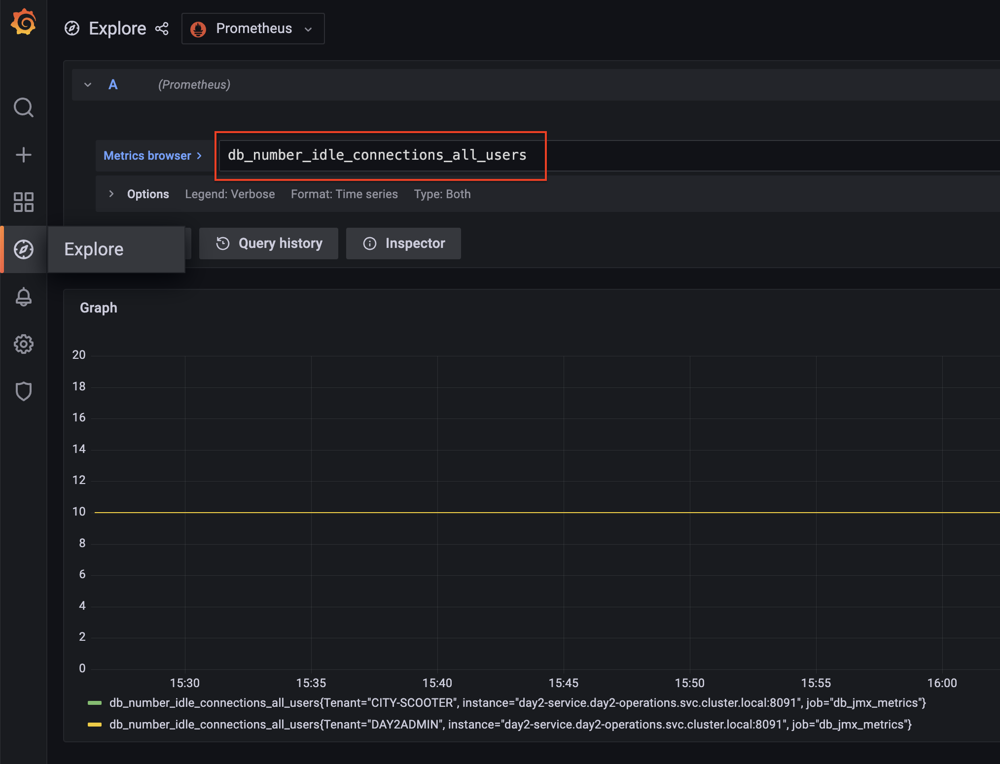
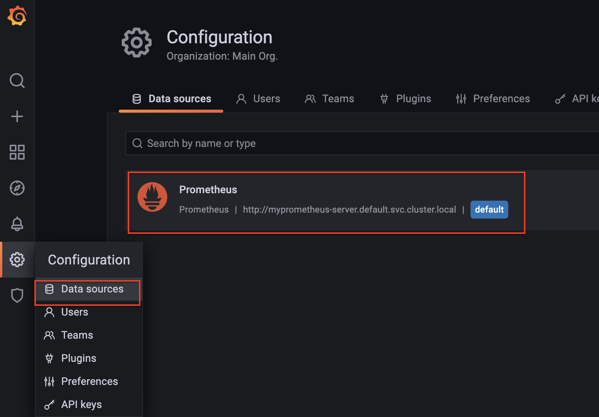
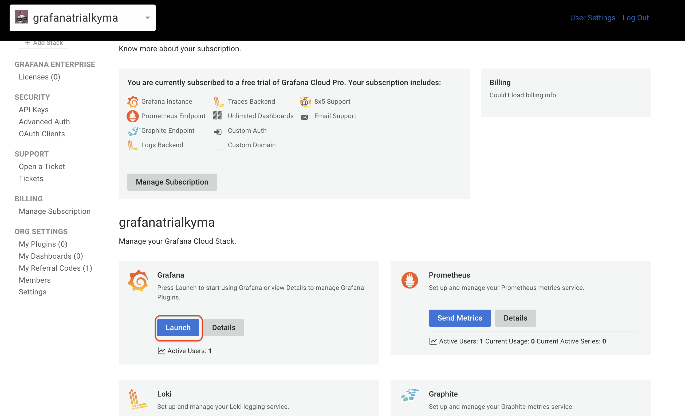
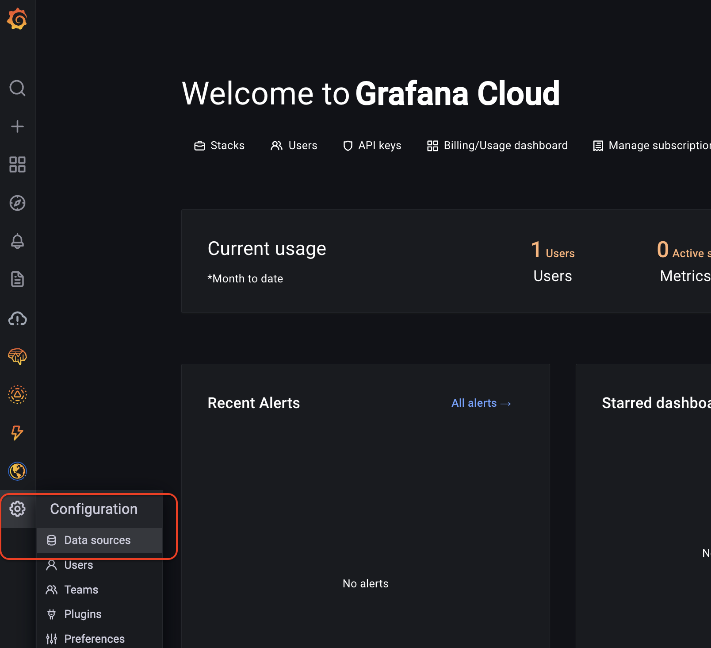
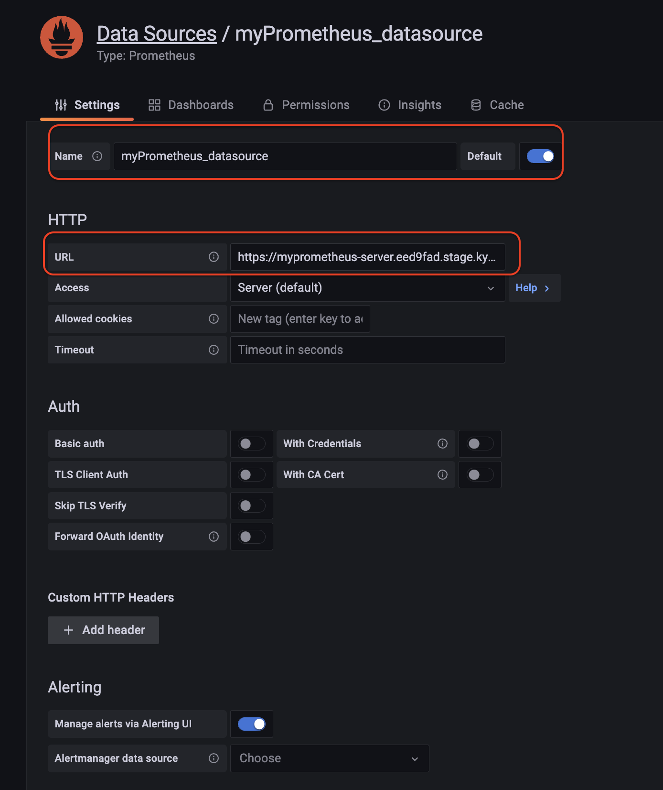

# Monitoring Kyma and Custom Workload Metrics in Custom Prometheus

> Note: this tutorial requires enabling custom metrics which are described in [monitor custom metrics in Dynatrace](../monitor-custom-metrics-in-dynatrace/README.md). Please make sure first finish it before continue.

Kyma ships already a built-in prometheus instance for easy access to pre-defined metrics like typical Kubernetes and Istio metrics. Workloads can expose custom metrics on top to increase the observability of the workload. However, with the bundled Prometheus of Kyma, custom metrics cannot be collected because of the unpredictable amount of data. It is recommended to either use a self-managed instance or export the data to an external too like Dynatrace. 

In this chapter we will show how to deploy a custom Prometheus instance to scrape custom metrics, while at the same time collects metrics from the build-in Prometheus。 It will consolidate metrics from different source into one single Prometheus instance. In addition, we will redirect the metrics from custom Prometheus instance to an external tooling, such as [Grafana Cloud Service](https://grafana.com/auth/sign-up/create-user) or a custom Grafana instance in your Kyma cluster.


<!-- TODO Matthieu: why not add Solution Diagram showing all the data flows described above? -->

## Install Custom Prometheus

Among other options, Prometheus could be easily installed using (1) [Prometheus operator kube-prometheus-stack](https://github.com/prometheus-community/helm-charts/tree/main/charts/kube-prometheus-stack) or typical (2) [Kubernetes deployment or statefulset](https://github.com/prometheus-community/helm-charts/tree/main/charts/prometheus).   The operator usually would use for installations which need to be scalable and highly available. Keeping in mind that Kyma uses the prometheus-operator internally. If you want to deploy your own instance of a prometheus-operator, please deny the "kyma-system" namespace (refer to https://github.com/kyma-project/kyma/issues/14379) as Kyma uses the prometheus-operator internally. For simplicity a native deployment with helm chart is used in this tutorial.


Follow the below steps to install a custom Prometheus instance in your Kyma cluster. In our case, it will be installed in the **default** namespace.

```shell
# add Prmetheus helm chart repo to your local helm repo
helm repo add prometheus-community https://prometheus-community.github.io/helm-charts
helm repo update

```

During installation we will disable the unnecessary components in the charts, and add two jobs to scrape additional metrics. A [prometheus_values.yaml](/code/day2-operations/deployment/k8s/prometheus_values.yaml) file with custom value for Prometheus is provided for this purpose. You can take a look to understand what have been changed.

Run the following command to install Prometheus with your custom value file.

```shell
helm install -f prometheus_values.yaml myprometheus prometheus
```

You can then run following command to access Prometheus at http://localhost:9091/

```shell
kubectl  port-forward svc/myprometheus-server 9091:80
```


## Expose Metrics to Prometheus Compliant Tooling

We will expose metrics of the custom Prometheus to an external tooling.  In this example two variants are demonstrated:

- Variant 1: In-cluster Grafana: a custom Grafana will be installed in the same Kyma cluster to enable the access to the Prometheus metrics.

- Variant 2: Grafana Cloud: Grafana Cloud is a SaaS platform, integrating metrics, traces and logs with Grafana. This variant will help you understand how third-party monitoring tools outside of your cluster can access metrics of your custom workload in the Kyma cluster.

### Variant 1: Install and Configure In-Cluster Grafana

We will use [Grafana Helm chart](https://github.com/grafana/helm-charts/tree/main/charts/grafana) to install Grafana in the Kyma cluster. 

```shell
# add Grafana helm chart repo to your local helm repo
helm repo add grafana https://grafana.github.io/helm-charts
helm repo update

```
We will add our custom Prometheus server as default datasource for Grafana. A [grafana_values.yaml](/code/day2-operations/deployment/k8s/grafana_values.yaml) file with custom value for Prometheus is provided for this purpose. You can take a look to understand what have been changed.

Run the following command to install the Helm chart with your custom values.

```shell
helm install -f grafana_values.yaml mygrafana grafana
```

Run below command and access your Grafana instance at http://localhost:3000

```shell
kubectl  port-forward svc/mygrafana 3000:80
```

For login credentials, the user is **admin** and the password can be retrieved with the following command:

```shell
kubectl get secret --namespace default mygrafana -o jsonpath="{.data.admin-password}" | base64 --decode ; echo
```

Then, navigate to **Explore** from the left sidebar and see what metrics are avaiable. The following screenshot shows an example of custom metric **db_number_idle_connections_all_users** from **day2-service**. 



In addition, you can also navigate to **Configuration** to check your Prometheus datasource configuration.



### Variant 2: Create and Configure Grafana Cloud Account

To add the custom Prometheus instance in the Kyma cluster as the datasource to Grafana Cloud, first we need to enable external access to the service myprometheus-server.

> **_NOTE:_** Following approach exposes the Prometheus API in an insecure way, please consider adding appropriate authentication.

1. Set the environment variable `DOMAIN`: 
```shell
export DOMAIN=$(kubectl config view --minify -o jsonpath='{.clusters[].cluster.server}' | sed -E 's_^https?://api.__')
```

2. Run the following commands to expose the service: 
```shell
cat <<EOF | kubectl apply -f -
apiVersion: networking.istio.io/v1beta1
kind: VirtualService
metadata:
  name: myprometheus-expose
spec:
  gateways:
    - kyma-system/kyma-gateway
  hosts:
  - myprometheus-server.$DOMAIN
  http:
  - match:
    - uri:
        regex: /.*
    route:
    - destination:
        host: myprometheus-server
        port:
          number: 80

EOF
```

3. Show your Prometheus service with the command `echo  https://myprometheus-server.$DOMAIN`. You will need the URL later to configure datasource in Grafana.


4. To create a free trial account on Grafana Cloud, see [Grafana Labs](https://grafana.com/auth/sign-up/create-user?pg=hp&plcmt=hero-btn1&cta=create-free-account) and follow the onscreen process. Once the account is created, open the Grafana instance by choosing **Launch**.

   

5. Inside the Grafana UI, navigate to **datasource**.

   
   
6. Choose **Add data source** of type Prometheus. 

   

7. Add a Prometheus datasource name and the Prometheus URL exposed earlier.



Now you should be able to explore the metrics in Grafana Cloud as usual. The following screenshot shows the custom metrics **db_max_pool_size** which is scraped from **day2-service**. 


