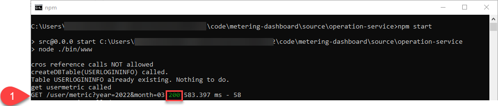

# No Active User Metering Values Displayed

1. Check in the console of the Day2 service the return status of the ```user/metric``` call. In case it is 200 as shown in the screenshot below, you have forgotten to set the envitoment variable to indicate the local run. Set ```local_dev=true``` and restart the Opeations service. 
    

1. Run the REST call against the Day2 service (replace year and month!) and check the result and the logs. 
    ```
    curl --request GET 'http://localhost:3000/user/metric?year=2022&month=3'
    ```